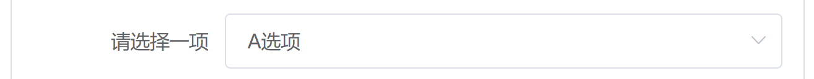
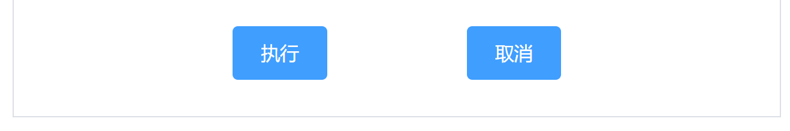

# 组件

## Form表单

hide-required-asterisk:是否隐藏必填字段的标签旁边的红色星号

[el-form表单验证的trigger类型](https://www.cnblogs.com/weibo258/p/14356307.html)

## table表格
当el-table元素中的data注入对象数组后，el-table-column中用prop属性对应对象的键名即可填入数据，label用来定义展示出来的列名，width定义列宽。

### 带斑马纹的表格

在el-table中使用stripe属性可以创建带斑马纹的表格
### 带竖直边框的表格

默认情况下，Table 组件是不具有竖直方向的边框的，如果需要，可以使用border属性
### 单选

选择单行数据时，用色块表示。配置highlight-current-row属性即可实现单选。之后由current-change事件来管理选中时触发的事件，它会传入currentRow，oldCurrentRow。如果需要显示索引，可以增加一列el-table-column，设置type属性为index即可显示从 1 开始的索引号。
### 排序
在列中设置sortable属性即可实现以该列为基准的排序。也可在el-table中设置default-sort属性设置默认的排序列和排序顺序，它的prop属性指定默认的排序的列，order指定默认排序的顺序。如果需要后端排序，需将sortable设置为custom，同时在 Table 上监听@sort-change事件，在事件回调中可以获取当前排序的字段名和排序顺序，从而向接口请求排序后的表格数据。
### slot-scope
通过 Scoped slot 可以获取到 row, column, $index 和 store（table 内部的状态管理）的数据。
### 展开行
当行内容过多，不想显示行滚动条时，可以使用Table展开行功能。
通过设置 type="expand" 和 Scoped slot 可以开启展开行功能，el-table-column 的模板会被渲染成为展开行的内容，展开行可访问的属性与使用自定义列模板时的 Scoped slot 相同。
### 事件
@row-click：点击某一行时触发该事件
@expand-change：当用户对某一行展开或关闭时触发该事件
### Table-column Attributes
show-overflow-tooltip：当内容过长被隐藏时显示 tooltip
>[Table 表格](https://element.eleme.cn/#/zh-CN/component/table)

## Progress 进度条
设置percentage属性即可，表示进度条对应的百分比，必填，必须在 0-100。通过 format 属性来指定进度条文字内容。通过 stroke-width 属性更改进度条的高度，并可通过 text-inside 属性来将进度条描述置于进度条内部。

## Collapse折叠面板
通过折叠面板收纳内容区域
```html
<el-collapse v-model="activeNames" @change="handleChange">
  <el-collapse-item title="一致性 Consistency" name="1">
    <div>与现实生活一致：与现实生活的流程、逻辑保持一致，遵循用户习惯的语言和概念；</div>
    <div>在界面中一致：所有的元素和结构需保持一致，比如：设计样式、图标和文本、元素的位置等。</div>
  </el-collapse-item>
  <el-collapse-item title="反馈 Feedback" name="2">
    <div>控制反馈：通过界面样式和交互动效让用户可以清晰的感知自己的操作；</div>
    <div>页面反馈：操作后，通过页面元素的变化清晰地展现当前状态。</div>
  </el-collapse-item>
  <el-collapse-item title="效率 Efficiency" name="3">
    <div>简化流程：设计简洁直观的操作流程；</div>
    <div>清晰明确：语言表达清晰且表意明确，让用户快速理解进而作出决策；</div>
    <div>帮助用户识别：界面简单直白，让用户快速识别而非回忆，减少用户记忆负担。</div>
  </el-collapse-item>
  <el-collapse-item title="可控 Controllability" name="4">
    <div>用户决策：根据场景可给予用户操作建议或安全提示，但不能代替用户进行决策；</div>
    <div>结果可控：用户可以自由的进行操作，包括撤销、回退和终止当前操作等。</div>
  </el-collapse-item>
</el-collapse>
<script>
  export default {
    data() {
      return {
        activeNames: ['1']
      };
    },
    methods: {
      handleChange(val) {
        console.log(val);
      }
    }
  }
</script>
```
### 手风琴效果
每次只能展开一个面板。
通过 accordion 属性来设置是否以手风琴模式显示。
比如第一行改为
```html
<el-collapse v-model="activeNames" accordion>
```
>[Collapse 折叠面板](https://cloud.tencent.com/developer/section/1489906)

## Select选择器
v-model的值为当前被选中的el-option的value属性值
```html
<el-select
  v-if="mode==='edit'&&scope.row.editing"
  v-model="scope.row.type"
  size="mini"
  style="width:100px"
>
  <el-option
    v-for="item in typeOptions"
    :key="item.value"
    :label="item.label"
    :value="item.value"
  />
</el-select>
```
#### 样式调整

##### 高度调整

el-select组件的高度是固定的，如果要调整，需要单独设置style，为了避免影响到其他的select组件，可以加个自定义class，如my-el-select，并修改el-input__inner属性。另外还要做好下面的配置工作

- 安装stylus的包**npm install stylus stylus-loader --save-dev**
- 在webpack.config.js中新增module的rules配置，用以匹配stylus样式的加载器

stylusDemo.vue

```vue
<template>
	<el-select v-model="cur" placeholder="请选择" class="my-el-select">
        <el-option v-for="item in items" :key="item" :label="item" :value="item"></el-option>
    </el-select>
</template>

<script>
    export default {
        name: 'stylus-demo',
        data() {
		    return {
                cur: '西瓜',
                items: ['西瓜', '苹果', '草莓', '香蕉', '菠萝']
            }
        }
    }
</script>

<style lang="stylus">
/* 自定义宽度 */
.my-el-select {
    width: 320px;
    /* selecte 框的高度设置，默认是 40px*/
    .el-input__inner{
        height: 30px;
    }
    /* 下面设置右侧按钮居中 */
    .el-input__suffix {
        top: 5px;
    }
    .el-input__icon {
        line-height: inherit;
    }
    .el-input__suffix-inner {
        display: inline-block;
    }
}
</style>
```

webpack.config.js

```js
module: {
    rules: [
        {
            test: /\.styl(us)?$/,//若不填写(us)?则无法解析vue里的style stylus样式
            use: ['style-loader', 'css-loader', 'stylus-loader']
        }
    ]
}
```

##### 宽度调整

如果想要 label宽度 + el-select宽度填满一行，只需在el-select的style中加上`display:block`即可



```vue
<el-select v-model="item.input_data" size="middle" filterable style="display:block"></el-select>
```

>[Select 选择器](https://cloud.tencent.com/developer/section/1489873)
>[Vue ElementUI el-select 改变高度](https://blog.csdn.net/sinat_31213021/article/details/114115024)
>[el-form-item 内的 el-select如何自适应宽度](https://segmentfault.com/q/1010000020225305)

## Dropdown下拉菜单
将动作或菜单折叠到下拉菜单中。
通过组件slot来设置下拉触发的元素以及需要通过具名slot为dropdown来设置下拉菜单。默认情况下，下拉按钮只要hover即可，无需点击也会显示下拉菜单。

>[Dropdown 下拉菜单](https://cloud.tencent.com/developer/section/1489899)

## Steps步骤条
引导用户按照流程完成任务的分步导航条，可根据实际应用场景设定步骤，步骤不得少于 2 步。

## Dialog对话框
before-close是在关闭对话框之前执行的事情。
```html
<el-button type="text" @click="dialogVisible=true">打开对话框</el-button>
<el-dialog title="提示" :visible.sync="dialogVisible" :before-close="handleClose">
  <span>你打开了对话框看到了这段话</span>
</el-dialog>
<script>
export default {
  data(){
    return {dialogVisible: false};
  },
  method:{
    handleClose(done){
      this.$confirm('确认关闭？')
      .then(_=>{
        done();
      })
      .catch(!=>{});
    }
  }
}
</script>
```

## Input输入框
* v-model绑定值
* disabled禁用
* clearable可清空
* show-password密码框
* prefix-icon 和 suffix-icon 可在组件首部和尾部增加显示图标

### 样式调整

> [Element：设置el-input宽度大小](https://blog.csdn.net/Xidian2850/article/details/104576398)

## CheckBox多选框

### 样式调整

#### 加粗label里面的文字部分

在el-checkbox中的style增加`font-weight:bold`即可

```vue
<el-checkbox :label="testingTool.name" style="font-weight:bold">哈哈哈 </el-checkbox>
```

> [如何给label里面的文字部分更改字体加粗](https://bbs.csdn.net/topics/390080895)

## Button按钮

### 样式调整

#### 2个按钮居中显示

可以外面包一个div，加上`align="center"`属性。



```vue
<div align="center" style="padding-bottom: 12px">
 <el-button size="middle" :theme="'primary'" type="primary" :outline="true" style="margin-right: 50px"
            @click="handleClickExecute">执行
 </el-button>
 <el-button size="middle" :theme="'primary'" type="primary" :outline="true" style="margin-left: 50px"
            @click="handleClickCancel">取消
 </el-button>
</div>
```

`注意button的style中的margin-right表示在按钮外部的右侧增加空白填充，而使用padding的话就会变成按钮内部填充，会影响按钮本身的形状`

## Switch开关

# 组件嵌套使用

## el-form中嵌套el-table

[element-ui的el-table与el-form的使用与表单校验](https://blog.csdn.net/weixin_56650035/article/details/117792216)
