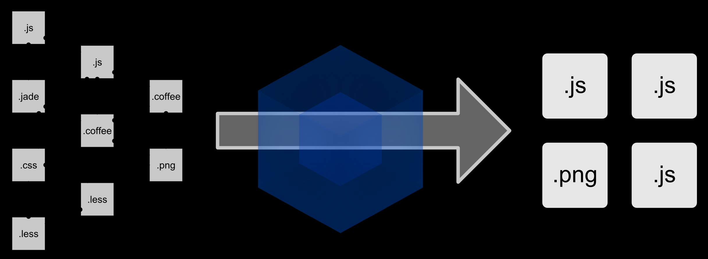
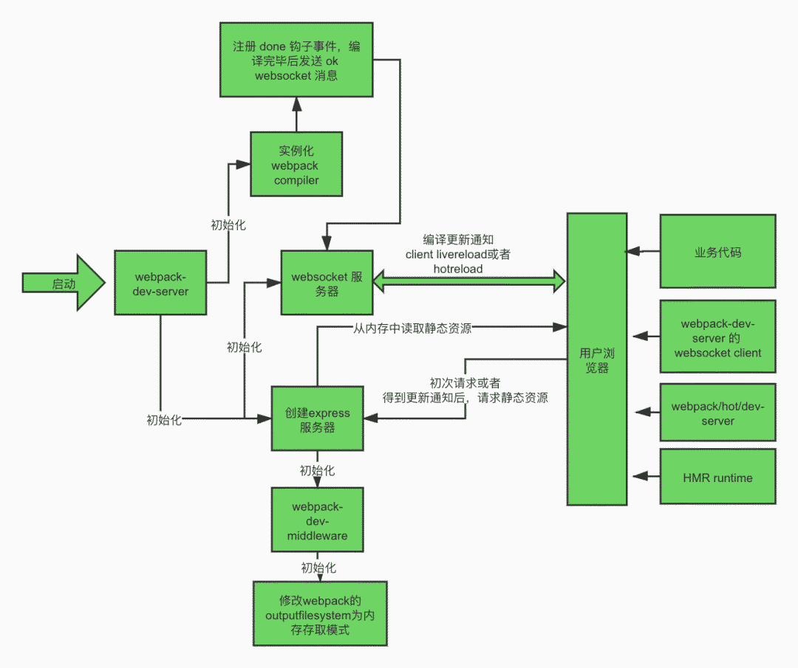

# Express服务器

## 概念

定义：[Express](https://so.csdn.net/so/search?from=pc_blog_highlight&q=Express) 是基于 Node.js 平台，快速、开放、极简的被广泛应用的第一款 Web 开发框架 。

通俗解释：Express 的作用和 Node.js 内置的 http 模块类似， 是专门用来创建 Web 服务器的。是被广泛应用的第一款服务器开发框架。

本质：就是一个 npm 上的第三方包，提供了快速创建 Web 服务器的便捷方法。

类似的框架：koajs、loopback、egg（阿里巴巴基于koajs开发，国内应用比较广泛）

## Express和原生Node.js对比

1. 原生 http 内置模块用起来很复杂，开发效率低；
2. Express是基于内置的 http 模块进一步封装出来的，能够极大的提高开发效率。

> - [express介绍与简单服务器的开启](https://blog.csdn.net/weixin_44022374/article/details/112904341)
> - [Express服务端开发框架简介及运行原理](https://www.cnblogs.com/wssjzw/p/9098102.html)

# Webpack

## 概述

Webpack 是一个前端资源加载/打包工具。它将根据模块的依赖关系进行静态分析，然后将这些模块按照指定的规则生成对应的静态资源。

从图中我们可以看出，Webpack 可以将多种静态资源 js、css、less 转换成一个静态文件，减少了页面的请求。



举个栗子，当我们使用vue开发时，写的都是.vue文件，对于浏览器来说是无法解析的，webpack做的事就是将所有的vue转化成浏览器能直接读取的js/html/css。

## 安装

```bash
npm install -g webpack webpack-cli  # 全局安装
```

## 初始化项目

### 1、创建webpack文件夹

进入webpack目录，执行命令

```bash
npm init -y
```

### 2、创建src文件夹

### 3、src下创建common.js

```js
exports.info = function (str) {
    document.write(str);
}
```

### 4、src下创建utils.js

```js
exports.add = function (a, b) {
    return a + b;
}
```

### 5、src下创建main.js

```js
const common = require('./common');
const utils = require('./utils');
common.info('Hello world!' + utils.add(100, 200));
```

## 体验JS打包过程

### 1、webpack目录下创建配置文件webpack.config.js

以下配置的意思是：读取当前项目目录下src文件夹中的main.js（入口文件）内容，分析资源依赖，把相关的js文件打包，打包后的文件放入当前目录的dist文件夹下，打包后的js文件名为bundle.js

```js
const path = require("path"); //Node.js内置模块
module.exports = {
    entry: './src/main.js', //配置入口文件
    output: {
   path: path.resolve(__dirname, './dist'), //输出路径，__dirname：当前文件所在路径
        filename: 'bundle.js' //输出文件
    }
}
```

### 2、命令行执行编译命令

```bash
webpack #有黄色警告
webpack --mode=development #没有警告
#执行后查看bundle.js 里面包含了上面两个js文件的内容并进行了代码压缩
```

也可以配置项目的npm运行命令，修改webpack目录下package.json文件

```json
"scripts": {
    //...,
    "dev": "webpack --mode=development"
 }
```

运行npm命令执行打包

```bash
npm run dev
```

### 3、webpack目录下创建index.html

引用bundle.js

```js
<body>
    <script src="dist/bundle.js"></script>
</body>
```

### 4、浏览器中查看index.html

## 体验CSS打包过程

### 1、安装style-loader和 css-loader

Webpack 本身只能处理 JavaScript 模块，如果要处理其他类型的文件，就需要使用 loader 进行转换。

Loader 可以理解为是模块和资源的转换器。

首先我们需要安装相关Loader插件，css-loader 是将 css 装载到 javascript；style-loader 是让 javascript 认识css

拓展：scss样式文件用sass-loader，vue文件用vue-loader，png/jpeg等图片、eot/ttf等字体格式静态文件用url-loader

```bash
npm install --save-dev style-loader css-loader 
```

### 2、修改webpack.config.js

```js
const path = require("path"); //Node.js内置模块
module.exports = {
    //...,
    output:{},
    module: {
        rules: [  
            {  
                test: /\.css$/,    //打包规则应用到以css结尾的文件上
                use: ['style-loader', 'css-loader']
            }  
        ]  
    }
}
```

### 3、在src文件夹创建style.css

```css
body{
    background:pink;
}
```

### 4、修改main.js

在第一行引入style.css

```js
require('./style.css');
```

### 5、浏览器中查看index.html

看看背景是不是变成粉色啦？

## 拓展：Webpack中的打包分块

webpack要干的事不仅仅是将浏览器不认识的资源转换成那3种静态资源，它还要将他们整合到一起，打包到一个文件中去，称之为bundle。

[深入理解 Webpack 打包分块（上）](http://qingbob.com/webpack-chunks-split-01/)

### Bundle VS Chunk VS Module

我们写的每一个vue文件/CommonJS模块/ES6模块都是一个Module（模块），但这只是狭义的理解，实际上从广义来讲，Module还包括样式和图片。

将所有的Module都打包成一个文件，这个文件就叫Bundle（包）。

如果想对包进行拆分，就可以分成多个Chunk（块）。

### 打包分离（Bundle Spliting）

当我们拥有体积庞大的项目，想要修改vue中的一行代码时，用户需要重新下载整个项目的Bundle，耗时严重。但是如果把Bundle分成多个文件，那么用户只需要去下载被修改的那个文件，另几个文件只要去缓存中拿即可。

注意打包分离仅仅跟缓存挂钩，如果是站点的首次访问则没有任何差别。

如果是频繁访问，那么打包分离就显得至关重要了。

> [webpack官网](https://webpack.js.org/)
>
> [webpack官方教程](https://webpack.docschina.org/concepts/)

# webpack-dev-middleware

## 概述

webpack-dev-middleware作用是生成一个与webpack compiler绑定的中间件，然后在express服务app中调用这个中间件。

该中间件的作用是

- 通过watch mode，监听资源的变更，并自动打包
- 快速编译，打包好的文件直接放内存
- 返回中间件，支持express的use格式

> - webpack也有watch mode，也能自动打包，但是webpack是将文件打包在本地，速度会很慢，所以要引入该中间件
> - `webpack-dev-middleware`一般和 `webpack-hot-middleware` 配合使用，实现热加载功能


# webpack-dev-server

## 概述

webpack 将我们的项目源代码进行编译打包成可分发上线的静态资源，在开发阶段我们想要预览页面效果的话就需要启动一个服务器伺服 webpack 编译出来的静态资源。webpack-dev-server 就是用来启动 webpack 编译、伺服这些静态资源，

除此之外，它还默认提供了liveReload的功能，就是在一次 webpack 编译完成后浏览器端就能自动刷新页面读取最新的编译后资源。为了提升开发体验和效率，它还提供了 hot 选项开启 hotReload，相对于 liveReload, hotReload 不刷新整个页面，只更新被更改过的模块。

webpack-dev-server的运行原理图如下



webpack-dev-server 可以作为命令行工具使用，核心模块依赖是 webpack 和 webpack-dev-middleware。

webapck-dev-server 负责

1. 启动一个 express 服务器监听客户端请求；
2. 实例化 webpack compiler；
3. 启动负责推送 webpack 编译信息的 webscoket 服务器；
4. 负责向 bundle.js 注入和服务端通信用的 webscoket 客户端代码和处理逻辑。

webapck-dev-middleware 负责

1. 把 webpack compiler 的 outputFileSystem 改为 in-memory fileSystem；
2. 启动 webpack watch 编译；
3. 处理浏览器发出的静态资源的请求，把 webpack 输出到内存的文件响应给浏览器。


每次代码更改并保存后，都会触发 webpack 自动重新编译，编译完成后会向客户端广播 ok 消息，客户端收到信息后根据是否开启 hot 模式使用 liveReload 页面级刷新模式或者 hotReload 模块热替换。hotReload 存在失败的情况，失败的情况下会降级使用页面级刷新。


[webpack-dev-server运行原理及源码解析](https://blog.csdn.net/LuckyWinty/article/details/109507412)

