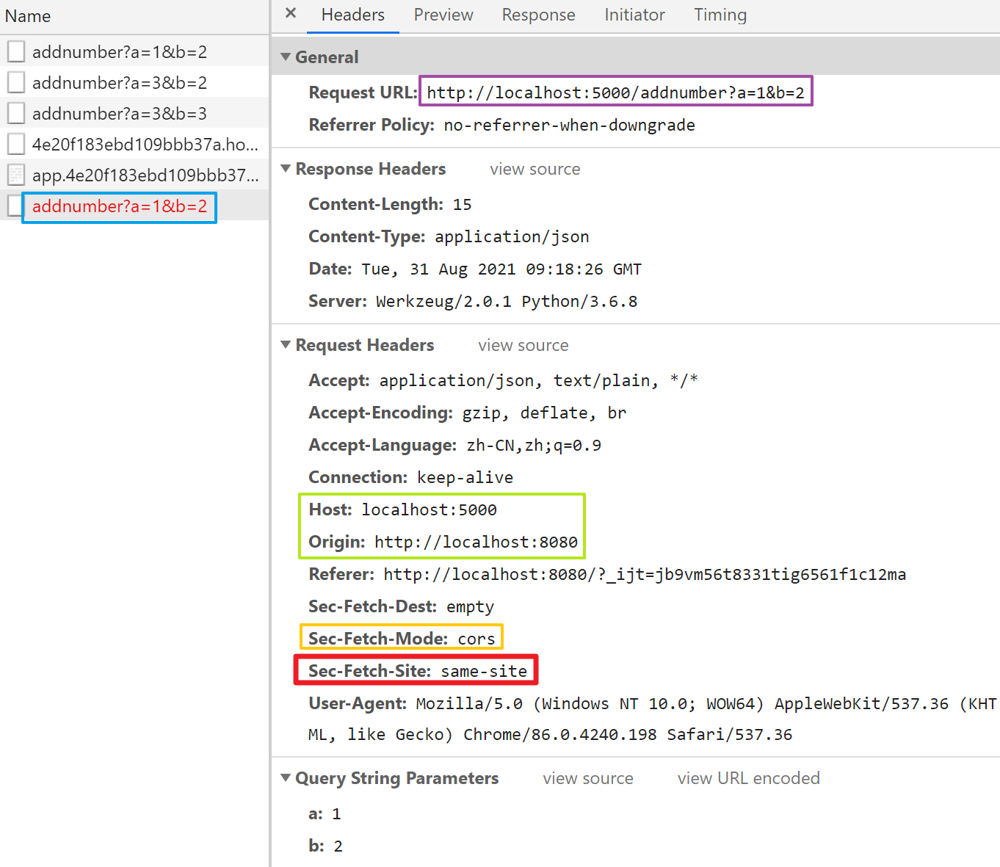
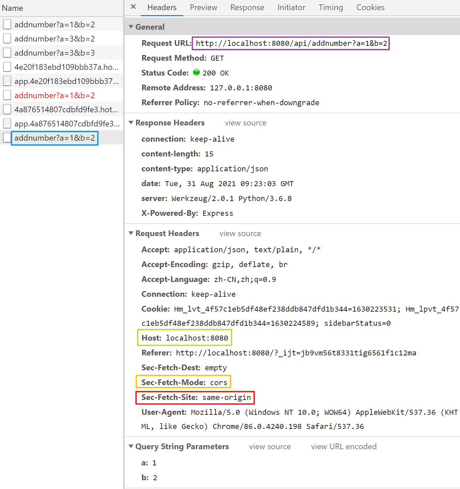

# Vue+Flask前后端交互
>[Python | Flask 解决跨域问题](https://www.jianshu.com/p/66f34be9cf81)  
[【vue】使用vue-cli4.0快速搭建一个项目](https://blog.csdn.net/liyunkun888/article/details/102738377)

## 跨域问题
Vue前端：http://localhost:8080  
Flask后端：http://localhost:5000
### 非代理方式
如果后端没有配置跨域CORS，vue前端也没有配置代理，那么当在前端使用axios发送请求到后端时，后端返回响应后，前端会报错。

* 注意此处的Request URL为http://localhost:5000/addnumber?a=1&b=2
* 此时的请求头信息中包含几个Web安全策略相关的元数据描述
```
Sec-Fetch-Dest: empty
Sec-Fetch-Mode: cors
Sec-Fetch-Site: same-site
```
* Mode为cors表明如果前后端跨域，前端就需要后端的响应包加上CORS响应头，如果服务端程序的响应包没有加上CORS响应头，vue前端程序将会拒绝服务端的响应。

前端监听事件method如下
```js
onadd() {
  this.$axios
    .get("/addnumber", {
      baseURL: "http://localhost:5000",
      timeout: 1000,
      params: {
        a: this.a,
        b: this.b,
      },
    })
    .then((res) => {
      console.log(res.data);
      this.sum = res.data.result; //获取后端计算结果
    })
    .catch(function (error) {
      console.log(error);
    });
},
```
要使用上面这种非代理的方式去请求后端服务，必须要在后端配置CORS响应头，否则会因为Origin不一致，即跨域的缘故导致前端无法正常接收后端的响应，并在Console中输出错误信息。
```
Access to XMLHttpRequest at 'http://localhost:5000/addnumber?a=1&b=2' from origin 'http://localhost:8080' has been blocked by CORS policy: No 'Access-Control-Allow-Origin' header is present on the requested resource.
Addnumber.vue?2d5d:56
Error: Network Error
    at createError (createError.js?2d83:16)
    at XMLHttpRequest.handleError (xhr.js?b50d:84)
xhr.js?b50d:177
GET http://localhost:5000/addnumber?a=1&b=2 net::ERR_FAILED
```
后端要加上CORS配置只需要在入口程序中加上下面的代码
```python
from flask import Flask
from flask_cors import CORS  # 解决跨域的问题
app = Flask(__name__)
CORS(app, supports_credentials=True)
```
然后重启后端，前端再次发送请求，此时可以正常接收后端的响应了

### 代理方式
在上面的非代理方式的Request Header中，Sec-Fetch-Site为same-site，表明请求源和目标资源的源不是同源的，即跨域请求。  
如果在前端换成代理方式进行请求，那么Request Header中的Host和Origin就一致了（这里绿色框框内把Origin直接省略了）。  
同时Sec-Fetch-Site也变成了same-origin，此时前端就不再需要后端加上CORS响应头也能正常接收响应包了。

#### 如何配置代理
vue3.0之后取消了build和Script目录，如果需要覆盖默认配置，需要在项目根目录下新建配置文件vue.config.js，然后在其中配置(注意changeOrigin一定要配置为true，否则无法实现同源)
```js
module.exports = {
  // webpack-dev-server 相关配置
  devServer: {
    open: true,
    proxy: {
      "/api": {
        target: "http://localhost:5000", // Flask的端口
        ws: true, //是否代理websockets
        changeOrigin: true, //设置同源 默认false，是否需要改变原始主机头为目标URL
        pathRewrite: {
          "^/api": "", //通过pathRewrite重写地址，将前缀/api转为/
        },
      },
    },
  },
};
```
前端vue组件中的axios请求参数也要变更，即在url前加上"/api"
```js
this.$axios
.get("/addnumber", {
  //发送到后端获取结果，其中/api对应vue.config.js 中的api
  baseURL: "/api",
  timeout: 1000,
  params: {
    a: this.a,
    b: this.b,
  },
})
```
这样发送请求前vue会先去匹配proxy，然后代理服务器会将Request URL http://localhost:8080/api/addnumber 隐式转换为http://localhost:5000/addnumber ，然后再发送到后端。  
这步转换在浏览器的Request Header中是看不到的，我们只能看到最原始的请求。  
同样的，后端返回的响应也会先到达代理服务器，将源地址转换为同源地址，然后再交给浏览器，此时浏览器不会去校验是否含有CORS响应头，因为是同源的。
