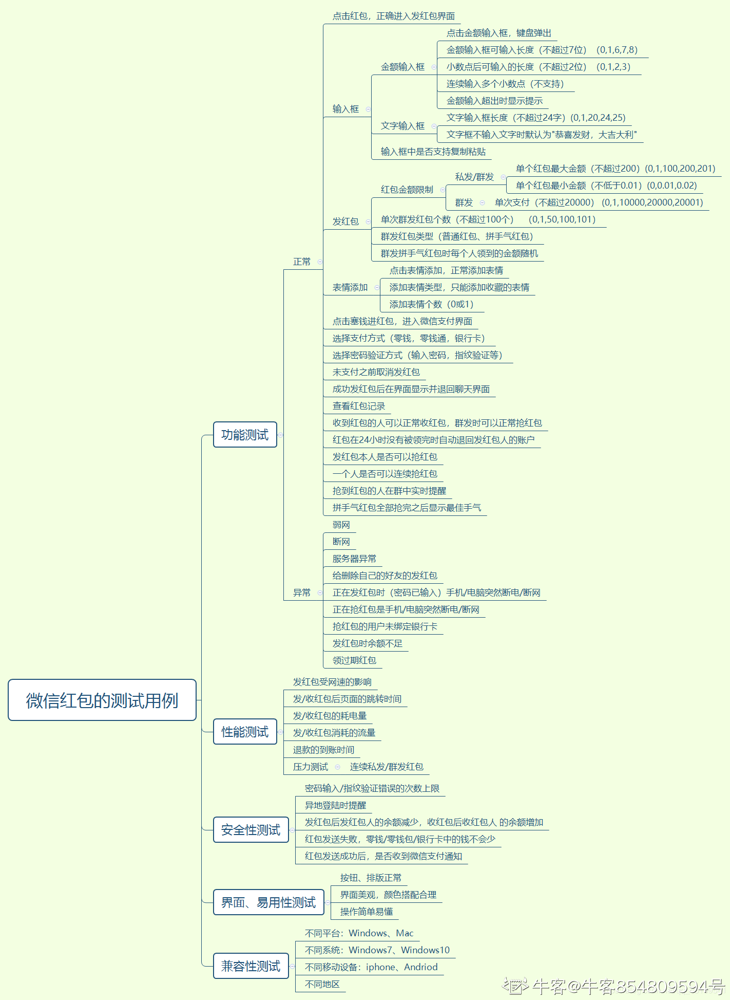

---------------------------------------------
## 腾讯后台开发实习岗一面凉经
C++：
	C++的左值和右值
	C++的智能指针
	vector、list插入删除的区别
	vector怎么扩容？是在原数组的基础上扩容吗？
	重载和覆盖->多态，虚函数，虚表
算法：反转链表（头插法）
数据库：
	主键索引和非主键索引->聚簇非聚簇
	索引的数据结构，B树和B+树的比较
	分布式事务
	事务特性（ACID）->隔离级别->InnoDB默认隔离级别可重复读->MVCC->可重复读的问题->undo log
	MySQL如何实现主备一致
OS：进程线程，一个进程中有10个线程，一个线程挂了，其他线程会挂吗？（看情况，如果线程之间有相互影响，比如A要等B将某个变量改为1才能继续执行，否则就一直自旋或者阻塞，这样B一挂掉，A也会挂掉）
Linux命令：查看进程运行状况（top实时、ps当前），查看网络端口（netstat）
大数据：有几千亿条数据（词语），统计一下其中出现频率最高的前100个词语（分文件，归并）

## 腾讯系统测试实习岗一面
### 项目
#### 微信聊天机器人
Spring MVC框架
怎么处理异常，比如算法出错
#### 会议管理系统
用的什么数据库（MySQL）
有用索引吗（唯一索引，外键）
用过锁吗（表锁、行锁、间隙锁）
有测试吗？怎么测试的？如果要对用户登录这一功能进行测试，可以考虑哪些点？（用户名密码的格式检查，匹配的正确性检查，安全性测试）

### 计网
HTTP状态码了解多少（301、302、304、307、403、404、500、503）
浏览器输入url回车后会发生什么（DNS、...）
浏览器缓存失效问题（Expires、Cache-Control）

### Java
引用类型（强引用、软引用、弱引用、虚引用）

### OS
进程和线程区别
协程是什么（联想到协程与线程的区别）

### 写代码
翻转数列
小Q定义了一种数列称为翻转数列: 给定整数n和m, 满足n能被2m整除。对于一串连续递增整数数列1, 2, 3, 4..., 每隔m个符号翻转一次, 最初符号为'-';。
例如n = 8, m = 2, 数列就是: -1, -2, +3, +4, -5, -6, +7, +8.
而n = 4, m = 1, 数列就是: -1, +2, -3, +4.
小Q现在希望你能帮他算算前n项和为多少。
输入描述
输入包括两个整数n和m(2 <= n <= 109, 1 <= m), 并且满足n能被2m整除。
输出描述
输出一个整数, 表示前n项和。
示例1
输入8 2
输出8

## 腾讯系统测试实习岗二面
自我介绍
项目：智能车（怎么测试的）、校园会议管理系统（Spring MVC框架，数据库怎么设计的）
HTTP，用户登录状态检查，session id的安全问题（Session与Cookie，HTTPS使用TLS混合加密）
单例的实现（写代码，6种）
写下校园会议管理系统的建表sql语句
闲聊：聊了下我的github，问上面的东西我都掌握了没有，我说那些笔记都是我根据自己的理解一个字一个字敲出来的。然后问了下大学3年印象最深的事情（不仅限于学习），balabala~
第三次面试，我有点紧张，有些地方说的不是很好，面试官挺和蔼的，准备做的很充分了，就不用紧张什么，问到不会的也不用慌，知识是学不完的，只要基础打好了就不用太过担心balabala~

## 腾讯系统测试实习岗三面
项目：校园会议管理系统
微信抢红包可能出现的问题？你要怎么设计后台架构？（多扣、少扣，消息传递不及时或者信息丢失）

春节抢红包，请求量太大，超过后台负荷怎么办（IO复用，减少线程数目；负载均衡，增加服务器处理）
笛卡尔积是什么（举数据库的例子：表A有4条数据，表B有3条数据，进行笛卡尔积就会有12条数据，用于多表查询）
进程间的数据怎么共享（进程通信的方式5种）
简单的算法题：有一个栈S，入栈顺序是a,b,c,d,e,f,g，出栈顺序是b,d,c,f,g,e,a，栈的最小容量是多少
闲聊：成绩排名，有没有拿到其他Offer，实习时间。
建议：理论挺扎实的，但是实践有所欠缺，建议看下大厂的测试经验案例，将理论与实践相结合。

## 腾讯系统测试实习岗GM/EVP/面委会
1. 下面代码输出结果是什么？为什么？
```Java
String s1 = new String("xyz");String s2 = "xyz";String s3 = "x" + "yz";
System.out.println(s1 == s2);//false
System.out.println(s2 == s3);//true
```
2. 下面运算得到的结果是什么？a=?,b=?
```Java
int a, b = 1; a=b++==10?0:++b;//好像是这样子的
```
3. 面向对象的三大特性？什么是多态？
封装，继承，多态。  
多态分为编译时多态和运行时多态，同一个类中重载方法能够实现编译时多态，子类重写父类的方法、同时用父类引用指向子类对象可以实现运行时多态。运行时多态是通过方法表（Java）实现的，永久代中每一个类都有一个方法表，其中存放了这个类的所有方法的符号到入口地址的映射。当子类没有重写父类方法时，子类的方法表中的对应父类方法符号将映射到父类的方法入口地址。如果重写了，就映射到子类的方法入口。当我们使用父类引用指向子类对象时，用父类引用调用被重写过的方法，运行时会去该引用指向的对象的对象头中找到该对象所属类在方法区的地址，然后从该类的方法表中找到对应的映射，即子类的方法表中的记录，这样就实现了运行时多态。
4. 进程间怎么通信？
信号、pipe、FIFO、Socket、共享内存
5. 进程和线程分别是什么的基本单位？协程是什么？解决什么问题的？
一个线程可以执行多个子程序，每个子程序就是一个协程，即一个线程可以有多个协程。如果用多线程来实现生产者消费者模型，那么就需要加锁，因为多线程的特点是抢占式多任务。但是如果使用多协程，由于只有一个线程，生产了东西后就去消费，消费完了再去生产，整个流程无锁，produce和consumer协作完成任务，因此叫做协程。  
协程最大的优势就是极高的执行效率，因为协程的切换只是子程序的切换，完全由用户程序控制，不需要进入内核态，减少线程切换的开销，相比多线程，协程数量越多，其性能优势就越明显。  
协程第二大优势就是无需多线程下的锁机制，因为整个流程都是单线程在执行，不存在写变量的冲突问题，共享变量不加锁，执行效率自然就高很多。  
6. 32位和64位操作系统的区别？
可寻址空间大小不同。指令集不同，总线上并行传送的数据位数不同，即CPU同时接收或发送的比特数量不同。32位的OS可以运行在64位的CPU上，但是64位的OS不能运行在32位的CPU上。
7. 端口是什么？
端口是设备与外界交流通信的出口。在网络中不同的主机通过IP地址来定位，但是如何区分出不同的服务呢？就是将不同的服务绑定到不同的端口上，比如HTTP对应80端口，HTTPS对应443，FTP对应21端口，SSH对应22，Telnet对应23，SMTP对应25等等。
8. 什么是二叉树？给出二叉树的前序和中序，还原出该二叉树，并画到纸上给我看
9. 写代码判断树B是否是树A的子树？只要val相等，不一定要Node的引用也相等。
10. 算法题：求解十进制1+11+111+1111+......+111...111（有2009个1）的结果中有多少个1，给个算法思路

## 腾讯系统测试实习岗HR面
#### 准备
15分钟，简短的聊了下，HR小哥哥很耐心地问我问题
说下你的经历吧
>我来自厦门大学信息学院，在读本科。
大学期间喜欢参加各种各样的活动与竞赛，拓宽自己的视野，比如校级的创客大赛、“联迪杯”智能互联创新大赛、电子设计竞赛、中美青年创客大赛、美国和国内的数学建模竞赛，投入最多的是智能车，从大二开始做到大二结束。大二还接手过一个技术性社团创客协会，当了一年社长，请了很多技术大牛来开办讲座和技术沙龙，学到了很多东西。
大三开始喜欢看一些技术博客，深入研究某些技术，比如JDK源码，JVM的底层原理、网络协议、MySQL原理什么的。

说说你觉得值得你作为榜样的人，他身上有什么特性值得你学习的

你最有成就感的事情是啥
>一个就是智能车吧，为了它我把我大二一年的青春都投进去了。已经数不清通宵了多少次，过程挺痛苦的，好在最后终于拿到了全国一等奖，这一年的付出也没有白费。不过后来再回过头仔细品味一下，真正让我觉得有成就感的并不仅仅是拿到了一等奖，而是进步的过程。最开始加入智能车队，并不是为了拿个什么奖，只是纯粹地想学东西，因为当时我刚结束完一大的悠闲时光，对一切都还很迷茫，又不想仅仅停留在学习课内的东西上，所以我在一个朋友的唆使下加入了智能车队。这个进步的过程是很缓慢的，前半年我并没有觉得自己nb了多少，唯一觉得有进步的就是和车队的哥们姐们混熟了关系。后面几个月，尤其是大二小学期和暑假，没有了繁重的课业负担后，我们几乎都在整天整天的调车调bug、试验新方案、优化程序。这几个月是我们成长最快的几个月，熬夜是家常便饭，经常也会因碰到一些奇奇怪怪的问题产生自暴自弃的念头。现在回想起来真是一段惨不忍睹的时光，不过我竟然竟然坚持下来了，挺让我惊讶的。

智能车你担任的角色是？你觉得对比你的队友，你的优点和缺点？
>这是一个4人团队项目，我是负责控制及识别算法研发的队员，主要研究基于IAR底层和OpenMV的识别算法，即图像处理。我认为我的优点在于编程基础扎实，因为队友都是物科、数院、电科的，对于编程要求并不高，所以很多时候我都是他们的C语言工具书。此外对于自己负责的部分一定会认真做好。缺点就是对于不是自己负责的部分就不怎么上心，后面发现这个问题的时候已经有点晚了，因为大家负责的任务涉及到的知识面还是有很多没有交叉的地方，需要学新的东西才能知道怎么解决，所以我也只能尽量想办法提供一些大体思路上的帮助。

遇到技术问题如何解决？
>先写一些demo验证一下自己的疑问和想法。如果解决不了，就去看看书或者博客探索一下其中的原理，看看自己能不能推出来前因后果，如果还是解决不了，就只能去百度谷歌找类似的问题了。

最快什么时候入职？
正常的话7月初，具体看学校安排，什么时候放假。

实习多久？
放假开始3个月都可以，开学应该可以请假。

能来深圳嘛
能！

问：
工作制度：一周工作几天
请问为什么有4个技术面呀？听说一般都是3个
需要实习多久才能转正？
我现在面试的是什么部门？
可以转岗WXG吗？
能不能加个微信
-----------------------------------------------
betterhe何梓涛
1. 自我介绍
2. Linux查看系统资源的命令
3. 如何查看内存泄漏
4. 内存泄漏了解吗
5. 进程与线程
6. 进程间通讯方式
7. TCP/IP的四层协议
8. socket通信过程
9. mysql的索引
10. 普通类和抽象类有哪些区别
11. Java内存分配的方式有哪些
12. 给一个代码，查看其作用
13. 给一个sql题，查询数学成绩排名前10
14. 为什么不在pcg参加留用考核
15. 算法（冒泡排序）。。。
16. 冒泡排序的测试用例
17. 滴滴做的工具
-----------------------------------------------
## 字节跳动测试开发一面
1. 1分钟自我介绍
2. 代码题
（1）一个无重复有序数组，快速找出给定数字的最小下标并输出
（2）服务器的日志的文件，每个月生成一个日志文件，例如：log_202003.txt，记录的内容如下：
时间戳 \t  登录人 \t  登录IP \t  操作
20200301 08:05:01\tzhangsan\t100.1.1.1\tip route show
统计一下上一天的登录次数最多的用户，输出该用户当天的所有操作？
（3）写下你写过的最复杂的sql语句
3. 项目  
写过测试的项目吗？（没有纯粹的测试，都是开发+测试）
让你设计测试用例的话，你会从哪些方面考虑？（功能、格式、边界条件、性能）
做过真正投入线上生产的项目吗？（没有）
4. Java  
多态的条件有哪些？
重载和重写分别是什么？
常用的容器有哪些？
什么是泛型？为什么要用泛型？
抽象类是什么？和普通的类有什么区别？
Java可以多继承吗？怎么实现多继承？
5. 网络  
HTTP响应的状态码
6. OS  
进程间通信有什么方式？什么场景下用消息队列？
7. MySQL  
主键有什么特性？
索引有哪几种？
-----------------------------------------------
## 百度QA测试开发笔试
###### 翻硬币
时间限制：C/C++语言 1000MS；其他语言 3000MS  
内存限制：C/C++语言 65536KB；其他语言 589824KB   
**题目描述：**  
桌子上放着N枚硬币，将其从1到N编号，初始时有的正面朝上，有的反面朝上。现在要将所有硬币翻至正面朝上，每次可以选择一个区间[L，R]（1≤L≤R≤N），并执行以下两种操作中的一种：  
①将编号为L到R的硬币翻面；  
②若编号为L到R的硬币均反面朝上，则将其翻至正面朝上。   
其中操作①所需的代价为x，操作②所需的代价为y，那么将所有硬币翻至正面朝上所需的总代价最小是多少？  
**输入**  
第一行包含三个整数N、x和y，1≤N≤105，1≤x，y≤10。  
第二行包含N个空格隔开的整数t1到tN，0≤ti≤1。若ti=0，则表示i号硬币初始时反面朝上；若ti=1，则表示i号硬币初始时正面朝上。  
**输出**  
输出总代价的最小值。  
**样例输入**  
3 1 2  
0 1 0  
**样例输出**  
2  
**提示**  
第一次选择区间[1，3]并执行操作①，第二次选择区间[2，2]并同样执行操作①。

###### 取数
时间限制：C/C++语言 1000MS；其他语言 3000MS  
内存限制：C/C++语言 65536KB；其他语言 589824KB  
**题目描述：**  
首先给出n个数字a1,a2,….an，然后给你m个回合，每回合你可以从中选择一个数取走它，剩下来的每个数字ai都要减去一个值bi。如此重复m个回合，所有你拿走的数字之和就是你所得到的分数。  
现在给定你a序列和b序列，请你求出最多可以得到多少分。  
**输入**  
输入第一行，仅包含一个整数n（1<=n<=100），表示数字的个数。  
第二行，一个整数m（1<=m<=n），表示回合数。  
接下来一行有n个不超过10000的正整数，分别为a1,a2…an.  
最后一行有n个不超过500的正整数，分别为b1,b2….bn.  
**输出**  
输出仅包含一个正整数，即最多可以得到的分数   
**样例输入**  
5
5
10 20 30 40 50
4 5 6 7 8
**样例输出**  
100
