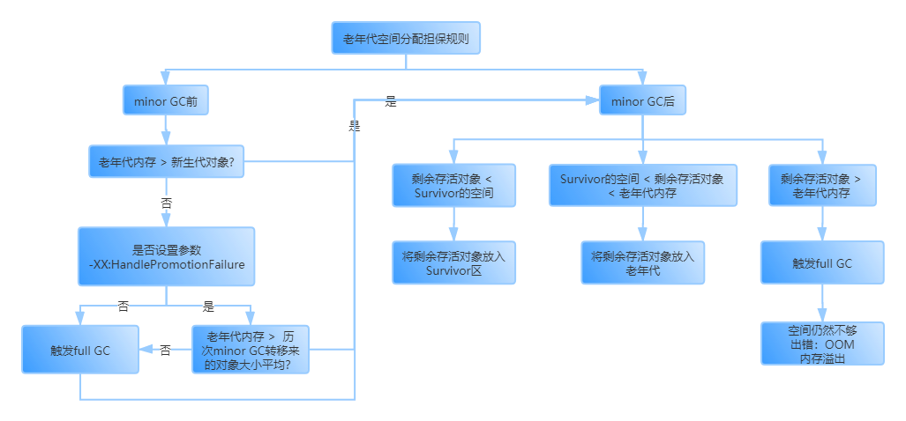

> #### 堆内存中的对象什么时候被回收
当新生代中的内存空间快满时会触发Minor GC去回收没有被引用的对象。

> #### 什么对象不会被回收
被GC Root引用的对象不会被回收。  
GC Root指方法中的局部变量或类间静态变量，类的实例变量（非静态变量，实例化后放在堆中）不是GC Root。

# 对象引用类型
### 强引用
```Java
A a = new A();
```
形如上述代码的引用即为强引用，即一个变量引用一个对象。即使内存很满了GC也不会去回收强引用的对象。

### 软引用
```Java
SoftReference<ReplicaManager> replicaManager = new SoftReference<ReplicaManager>();
```
一个实例对象被"SoftReference"类型的对象包裹，就是软引用。

软引用的对象在内存空间足够时不会被回收。但是一旦内存空间不够时，GC就会将该对象回收。

如果和引用队列配合使用，在GC清理掉这个对象后，会将相应的引用加入引用队列中。

### 弱引用
```Java
WeakReference<ReplicaManager> replicaManager = new WeakReference<ReplicaManager>();
```
一个实例对象被"WeakReference"类型的对象包裹，就是弱引用。

弱引用的对象，只要GC被触发，GC就会将该对象回收，无论内存空间够不够。

如果和引用队列配合使用，在GC清理掉这个对象后，会将相应的引用加入引用队列中。

### 虚引用
只要触发了GC就会被回收，主要用于跟踪垃圾回收的过程。

> ## finalize()
>在Java中定义一个类，如果没有使用extends声明这是谁的继承类，就会默认继承Object类

如果一个对象没有被任何GC Roots引用了，理论上会被回收。但是如果该对象重写了Object类中的方法finalize()，那么GC在回收这个对象前会调用这个重写的finalize()方法，让某个静态变量重新引用自己，就可不用被回收。
```Java
public class ReplicaManager{
  public static ReplicaManager instance;
  protected void finalize() throws Throwable{
    ReplicaManager.instance = this;
  }
}
```

-------------------------------------------

# 新生代垃圾回收算法
## 不太好的垃圾回收思路
标记未被引用的对象，然后一次性回收。
>缺陷：会产生大量内存碎片，造成严重的内存空间浪费。

## 复制算法
将堆内存平均分为两部分A,B，每次GC前只使用其中一部分。具体过程如下：
1. 创建的新对象都放在A区
2. 当A区空间已满时触发GC，标记仍被GC Root引用的对象
3. 将标记的对象一次性搬到B区的连续内存区域中
4. 接下来创建的新对象都放在B区
5. 当B区空间已满时触发GC，标记仍被GC Root引用的对象
6. 将标记的对象一次性搬到A区的连续内存区域中
7. 重复上述步骤

>缺陷：如果堆内存分配了1G空间，那么只有500M能被有效使用，但是事实上大多数对象的存活时间很短，一般触发GC时只有1%的对象仍被引用。这样的复制算法会造成内存使用率低下。

## 复制算法的优化
将堆内存划分为3个区域：1个Eden区（80%），2个Survivor区（一个占10%）

对象的生成与回收过程如下：
1. 一开始所有创建的对象都在Eden区
2. E区满，触发GC，标记所有仍被引用的对象
3. 将标记对象复制到其中一个Survivor区（S1区），其他对象一次性清空
4. 接下来创建的对象都放在Eden区和S1区
5. 再次触发GC，标记所有仍被引用的对象
6. 将标记对象复制到S2区，其他对象直接清空
7. 接下来创建的对象都放在Eden区和S2区
8. 不断重复上述步骤

从上述过程可以看出，始终都有一个Survivor区处于空闲状态，但是其余90%的空间都被有效使用。极大提高了空间利用率。

## 新生代的对象何时进入老年代
### 超过分代年龄：15岁规则
长期存活的对象如果躲过了15次（可自行设定）垃圾回收，就会被放入老年代
>进入老年代的岁数可通过JVM参数设定

```Java
-XX:MaxTenuringThreshold
```
### 动态对象年龄判断
触发minor GC时，先依次判断年龄1,年龄2,年龄3,...,年龄k(k=1,2,3,...)的同龄对象是否大于Survivor区大小的50%，如果是，就将年龄为k的对象都放到老年代，其余的放入空闲的Survivor区。

### 大对象直接放入老年代
如果将下述JVM参数设置为"1048576"字节，也就是1M，则每当创建一个新对象时，如果这个对象需要的空间大于1M，则直接进入老年代。
```Java
-XX:PretenureThreshold
```
### 老年代空间分配担保规则


--------------------------------------------

# 老年代垃圾回收算法
触发full GC时，将所有存活对象重排，即复制到一个尽量紧凑的内存块中。

### full GC的触发时机
1. 老年代内存空间小于新生代所有对象大小时，如果没有开启老年代空间担保机制，就会触发full GC
2. 如果开启了空间担保机制，但是老年代内存空间小于历次平均移动对象大小
3. minor GC后，剩余存活对象放不下Survivor区，而老年代内存空间也不够放下这些对象时
4. 设置了*-XX:CMSInitiatingOccupancyFaction*参数，比如默认为92%，当老年代内存占用超过92%，就会自动触发full GC。

### 要进行JVM调优的根本原因
如果系统频繁触发full GC垃圾回收，会导致系统性能被严重影响，可能会出现频繁卡顿的情况。

### 如何做到full GC触发次数为0
* 增大分代年龄：比如将默认的15增大为30。
* 用特定工具，分析出每秒会创建多少对象，大概多久会触发minor GC，每次minor GC后有多少存活对象，保证Survivor区能放下，而且不会触发动态年龄判断机制使这些对象进入老年代。

--------------------------------------------

# JVM中常见的垃圾回收器
>#### Stop the World
当GC时，系统程序的工作线程将被阻塞，直至GC完毕，才能将其他JVM线程继续运行（创建新对象）

## Serial和Serial Old
分别用来回收新生代与老年代的对象。
* Serial采用复制算法
>单线程运行，垃圾回收时会停止系统的其他工作线程，卡死不动，现在Java后端基本不用。

## ParNew和CMS
分别用来回收新生代与老年代的对象。
* ParNew采用复制算法
>多线程并发，线上生产系统的标配组合。

### ParNew

#### 如何指定系统使用ParNew垃圾回收器
```Java
-XX:+UseParNewGC
```
使用上述参数加入这个选项，就可指定对新生代进行垃圾回收的垃圾回收器为ParNew。

#### ParNew垃圾回收器的线程数量
默认为CPU核数。
```Java
-XX:ParallelGCThreads
```
可通过上述参数设置线程数量。一般不建议修改。

### CMS
CMS垃圾回收线程与系统工作线程尽量同时执行的模式。
#### CMS执行一次垃圾回收的过程
###### 初始标记
* 让系统工作线程全部停止工作，进入Stop the World状态。
* 通过GC Roots标记出它们直接引用的对象。

###### 并发标记
* 系统工作线程继续正常工作。
* 进行GC Roots跟踪，标记所有被GC Roots间接引用的对象。比如类间静态变量A引用了对象A1，A1中的实例变量B引用了对象B1，但是在初始标记时B1不会被标记，于是在并发标记过程中被标记为存活对象。这就是GC Root间接引用。

###### 重新标记
* 再次让系统工作线程全部停止工作，进入Stop the World状态。
* 标记上一步骤中系统工作线程运行过程中新产生的对象和不再被引用的垃圾对象。

###### 并发清理
* 系统工作线程继续正常工作。
* 开始对标记的垃圾对象进行清理。

#### 碎片整理
在full GC后，会产生大量的内存碎片，如果不对碎片进行整理，后续会更加频繁的触发full GC。因此在full GC后，CMS会进行碎片整理。是否进行碎片整理可用下面的参数进行控制，默认是打开：
```Java
-XX:+UseCMSCompactAtFullCollection
```

###### 碎片整理的过程
进入 *Stop the World* ，令系统线程停止，然后将老年代存活对象都挪到一块，空出大量内存空间。

下面的参数用来指定每几次full GC进行一次碎片整理：
```Java
-XX:CMSFullGCsBeforeCompaction
```

#### Concurrent Mode Failure
在CMS线程进行并发清理的过程中，系统线程又产生了一些新的对象，触发minor GC时要将一些对象搬到老年代，但是老年代的内存已经不够了，此时就会发生 *Concurrent Mode Failure* 。
此时，Serial Old就会出来替代CMS去执行老年代的回收清理，将系统线程全部阻塞，等Serial Old清理完毕后再恢复系统线程。

可通过合理优化自动触发CMS垃圾回收的比例来避免Concurrent Mode Failure。

###### CMS自动触发时机
当老年代内存占用达到一定比例，就会自动触发CMS去执行GC。
```Java
-XX:CMSInitialingOccupancyFaction
```
该参数可用来设置该比例，JDK1.6默认为92%。


## G1垃圾回收器
### 概述
统一回收新生代与老年代的对象，采用更好的算法与机制。

将内存划分为多个Region，不在物理上区分新生代与老年代，只在逻辑上区分。

Region可动态转移，在不同时刻，同一个Region可能前一刻是新生代，后一刻就是存放长期存活对象的老年代了。

可自行设置GC对系统性能的影响，G1将判断每个Region垃圾回收的耗时与回收对象的大小，选取停顿时间短、回收对象多的Region进行GC，在指定的时间范围内回收尽可能多的对象。

### Region大小
一个JVM中默认最多有2048个Region，如果给堆内存分配了4G，则一个Region的大小为2M。

### 新生代在Region中的分布
新生代在堆内存中最多占60%的内存，即大约1288个Region。相应的老年代就是40%。

但是在一开始不会直接分配这么多Region给新生代，而是**动态增长**，增长到60%为止。

在G1的机制中，新生代也是有Eden和Survivor区的，而且默认比例也是8：2，可自行调整。比如这里就可以有大约1000个Region是Eden区，2个Survivor区分别占用100个Region。

如果刚开始分配了200个Region区给Eden，则S区分别占20个Region，当创建的对象越来越多，Eden区快满掉了，就会分配新的Region区给新生代。当新生代占到60%时，就会触发G1垃圾回收器来回收新生代的垃圾。回收过程也是将存活对象**复制**到另一个S2区中，然后将Eden区与S1区全部清空。

G1根据我们设置的最长停顿时间，选择性的回收部分Region，保证在最短时间内回收最多的对象。具体回收过程是通过一个优先队列来实现，每个Region按照垃圾对象所占比例进行排序，触发G1垃圾回收器时会从优先队列中弹出部分Region进行回收。

回收后的Region区又回归空闲状态，可能下一次会被标记为老年代，也有可能还是新生代。这就是**动态转移**。

进入老年代的时机与之前类似。

另外，**大对象是被单独分配** 的，而不是放在老年代，可能一个大对象会横跨多个Region。

### 新生代和老年代混合垃圾回收 Mixed GC
##### 何时触发Mixed GC
老年代的堆内存占比超过45%时，触发G1的混合垃圾回收。

##### G1垃圾回收的过程
###### 初始标记
进入“Stop the World”，标记GC Roots直接引用的对象。

###### 并发标记
允许系统程序运行，进行GC Roots跟踪，标记所有GC Roots间接引用的对象。同时记录这期间系统程序运行导致Region发生的修改，比如哪些对象变成了垃圾对象，产生了哪些新对象。

###### 最终标记
进入“Stop the World”，根据上一步的修改记录作出最终的标记。

###### 混合回收
* 计算老年代每个Region中的存活对象占比、执行垃圾回收的预期性能与效率。
* 进入“Stop the World”，从新生代、老年代、大对象中挑选出一些Region进行回收，保证垃圾回收的停顿时间不超过指定时间。
>回收的具体过程是使用复制算法，将存活对象都复制到空闲的Region中，然后将原来的Region清空。这样就**不会产生内存碎片**。

##### G1垃圾回收器的参数及默认值
```Java
-XX:G1MixedGCCountTarget
```
默认8：多次混合回收。如果一次混合回收预期要回收160个Region，则会先回收20个，然后再让系统继续运行一段时间，然后再次执行混合回收，反反复复8次结束。这样可使系统程序尽量不要停顿太长时间，在回收的间隙也能运行一会。

```Java
-XX:G1HeapWastePercent
```
默认5%：在混合回收清理后，新空闲出来的Region超过堆内存的5%后，就停止混合回收。

```Java
-XX:G1MixedGCLiveThresholdPercent
```
默认85%：当Region中的存活对象占比低于85%才可进行回收，否则不回收。否则会因为复制大量存活对象而影响效率。

##### 混合回收失败时触发full GC
当混合回收时，发现已经没有空闲的Region来放拷贝的存活对象，就会触发一次失败，开始full GC，然后停止系统程序，采用单线程从头开始标记、清理、压缩整理，空闲出来一批Region，这个过程非常慢。
