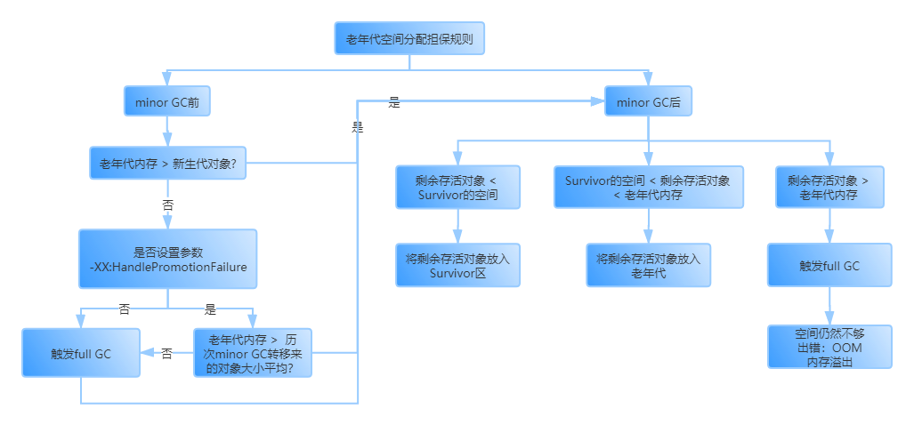

# 什么时候被回收
当新生代中的内存空间快满时会触发Minor GC去回收没有被引用的对象。

# 什么对象不会被回收
被GC Root引用的对象不会被回收。  
GC Root指局部变量或类间静态变量。

# 对象引用类型
### 强引用
```Java
A a = new A();
```
形如上述代码的引用即为强引用，即一个变量引用一个对象。即使内存很满了GC也不会去回收强引用的对象。

### 软引用
```Java
SoftReference<ReplicaManager> replicaManager = new SoftReference<ReplicaManager>();
```
一个实例对象被"SoftReference"类型的对象包裹，就是软引用。

软引用的对象在内存空间足够时不会被回收。但是一旦内存空间不够时，GC就会将该对象回收。

如果和引用队列配合使用，在GC清理掉这个对象后，会将相应的引用加入引用队列中。

### 弱引用
```Java
WeakReference<ReplicaManager> replicaManager = new WeakReference<ReplicaManager>();
```
一个实例对象被"WeakReference"类型的对象包裹，就是弱引用。

弱引用的对象，只要GC被触发，GC就会将该对象回收，无论内存空间够不够。

如果和引用队列配合使用，在GC清理掉这个对象后，会将相应的引用加入引用队列中。

### 虚引用
只要触发了GC就会被回收，主要用于跟踪垃圾回收的过程。

# finalize()
>在Java中定义一个类，如果没有使用extends声明这是谁的继承类，就会默认继承Object类

如果一个对象没有被任何GC Roots引用了，理论上会被回收。但是如果该对象重写了Object类中的方法finalize()，那么GC在回收这个对象前会调用这个重写的finalize()方法，让某个静态变量重新引用自己，就可不用被回收。
```Java
public class ReplicaManager{
  public static ReplicaManager instance;
  protected void finalize() throws Throwable{
    ReplicaManager.instance = this;
  }
}
```

# 新生代垃圾回收算法
## 不太好的垃圾回收思路
标记未被引用的对象，然后一次性回收。
>缺陷：会产生大量内存碎片，造成严重的内存空间浪费。

## 复制算法
将堆内存平均分为两部分A,B，每次GC前只使用其中一部分。具体过程如下：
1. 创建的新对象都放在A区
2. 当A区空间已满时触发GC，标记仍被GC Root引用的对象
3. 将标记的对象一次性搬到B区的连续内存区域中
4. 接下来创建的新对象都放在B区
5. 当B区空间已满时触发GC，标记仍被GC Root引用的对象
6. 将标记的对象一次性搬到A区的连续内存区域中
7. 重复上述步骤

>缺陷：如果堆内存分配了1G空间，那么只有500M能被有效使用，但是事实上大多数对象的存活时间很短，一般触发GC时只有1%的对象仍被引用。这样的复制算法会造成内存使用率低下。

## 复制算法的优化
将堆内存划分为3个区域：1个Eden区（80%），2个Survivor区（一个占10%）

对象的生成与回收过程如下：
1. 一开始所有创建的对象都在Eden区
2. E区满，触发GC，标记所有仍被引用的对象
3. 将标记对象复制到其中一个Survivor区（S1区），其他对象一次性清空
4. 接下来创建的对象都放在Eden区和S1区
5. 再次触发GC，标记所有仍被引用的对象
6. 将标记对象复制到S2区，其他对象直接清空
7. 接下来创建的对象都放在Eden区和S2区
8. 不断重复上述步骤

从上述过程可以看出，始终都有一个Survivor区处于空闲状态，但是其余90%的空间都被有效使用。极大提高了空间利用率。

# 新生代的对象何时进入老年代
## 15岁规则
长期存活的对象如果躲过了15次（可自行设定）垃圾回收，就会被放入老年代
>进入老年代的岁数可通过JVM参数设定

```Java
-XX:MaxTenuringThreshold
```
## 动态对象年龄判断
触发minor GC时，先依次判断年龄1+年龄2+年龄3+...+年龄k(k=1,2,3,...)的对象是否大于Survivor区大小的50%，如果是，就将年龄>=k的对象都放到老年代，其余的放入空闲的Survivor区。

## 大对象直接放入老年代
如果将下述JVM参数设置为"1048576"字节，也就是1M，则每当创建一个新对象时，如果这个对象需要的空间大于1M，则直接进入老年代。
```Java
-XX:PretenureThreshold
```
## 老年代空间分配担保规则


# 老年代垃圾回收算法
触发full GC时，将所有存活对象重排，即复制到一个尽量紧凑的内存块中。

### 要进行JVM调优的根本原因
如果系统频繁触发full GC垃圾回收，会导致系统性能被严重影响，可能会出现频繁卡顿的情况。
