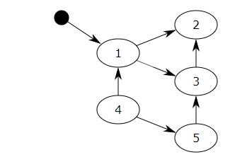

# 一、引用计数

Python 垃圾回收以引用计数为主，分代回收为辅。引用计数法的原理是每个对象维护一个ob_refcnt，用来记录对象被引用的次数，也就是用来追踪有多少个引用指向了对象，当发生以下四种情况的时候，对象的引用计数+1：

对象被创建，比如：a = 14
对象被引用，比如： b = a
对象被作为参数，传给函数，比如：func(a)
对象作为容器中的一个元素，比如：List = {a, ”a” , ”b”, 2}
与上述情况相对应，当发生以下四种情况时，对象的引用计数-1：

对象的别名被显式销毁，比如：del a
对象的别名被赋予新的对象，比如：a = 26
对象离开它的作用域，比如 func() 执行完毕时，函数里面的所有局部变量的引用计数都会减 1
将元素从容器中删除，或者容器被销毁
当对象的引用计数为 0 时，它将被 Python 虚拟机回收。

在 Python 中一切皆对象，它们的核心是 Py_Object 结构体，所有 Python 对象的头部都包含该结构：


```C
// object.h
#define PyObject_HEAD   
  _PyObject_HEAD_EXTRA  
  Py_ssize_t ob_refcnt;  
  struct _typeobject *ob_type;
  ​
  typedef struct _object {
   PyObject_HEAD
  } PyObject;
```

比如 int 类型的定义如下：
```C
// intobj.h
typedef struct {
 PyObject_HEAD
 long ob_ival;
} PyIntObject;
```

简而言之，PyObject 是每个对象必有的内容，其中 ob_refcnt 是对象的引用计数。对象有新的引用时，它的 ob_refcnt 会增加；当对象的引用被删除时，ob_refcnt 会减少。当引用计数为 0 时，对象的生命周期就结束了。

```C
// object.h
#define Py_INCREF(op) (    
 _Py_INC_REFTOTAL _Py_REF_DEBUG_COMMA
 ((PyObject*)(op))->ob_refcnt++)

#define Py_DECREF(op)     
 do {      
   if (_Py_DEC_REFTOTAL _Py_REF_DEBUG_COMMA
   --((PyObject*)(op))->ob_refcnt != 0)  
    _Py_CHECK_REFCNT(op)   
   else     
   _Py_Dealloc((PyObject *)(op));   
 } while (0);
```

## 引用计数有很明显的优点：

* 高效
运行期没有停顿，即实时性：对象一旦没有引用，将直接被释放。实时性还带来一个好处是：处理回收内存的时间分摊到了平时
* 对象有确定的生命周期
* 易于实现

原始的引用计数法也有明显的缺点：
* 维护引用计数消耗资源，维护引用计数的次数和引用赋值成正比
* 无法解决循环引用的问题，比如：

```Python
list1 = []
list2 = []
list1.append(list2)
list2.append(list1)
```

为了解决这两个致命弱点，Python 又引入了以下两种 GC 机制。

# 二、标记-清除

『标记-清除（Mark-Sweep）』算法是一种基于追踪回收（tracing GC）技术实现的垃圾回收算法。它分为两个阶段：第一阶段是标记阶段，GC 会给所有『活动对象』打上标记；第二阶段是回收没有标记的『非活动对象』。那么 GC 如何判断哪些是活动对象、哪些是非活动对象呢？

对象之间通过引用（指针）连在一起，构成一个有向图。对象是有向图的顶点，引用关系是有向图的弧。从根对象（root object）出发，遍历有向图，将可达的（reachable）对象标记为活动对象，不可达的对象就是要被清除的非活动对象。根对象是全局变量、调用栈、寄存器。



在上图中，把小黑圈视为全局变量，也就是把它作为 root object，从小黑圈出发，对象 1 可直达，那么它将被标记，对象 2、3 可间接到达，也会被标记，而 4 和 5 不可达，因此 1、2、3 是活动对象，4 和 5 是非活动对象，会被 GC 回收。

标记清除算法作为 Python 的辅助垃圾回收技术，主要用于处理容器对象，比如 list、dict、tuple、instance 等，因为字符串、数值等原子类型的对象不可能造成循环引用问题。Python 使用双向链表将容器对象组织起来。不过这种简单粗暴的标记清除算法也有明显的缺点：清除非活动对象前，必须顺序扫描整个堆内存，哪怕只剩下小部分非活动对象，也要扫描所有对象。

# 三、分代回收

分代回收是一种以空间换时间的操作方式，Python 将内存根据对象的存活时间划分为不同的集合，每个集合称为一个代，Python 将内存分为了 3 代，分别为年轻代（第 0 代）、中年代（第 1 代）、老年代（第 2 代），它们对应是 3 个链表，垃圾回收频率随着对象存活时间的增大而减小。新创建的对象都会被分配到年轻代，当年轻代链表的节点总数达到上限时，Python 垃圾收集机制就会被触发，把可以被回收的对象回收掉，而不能被回收的对象会被移到中年代去，依此类推，老年代中的对象是存活时间最久的对象，甚至存活于整个系统的生命周期内。分代回收建立在标记清除的基础之上，分代回收同样作为 Python 处理容器对象的辅助垃圾回收技术。

# 问题
## 为什么Python要使用有明显缺陷的引用计数回收机制？
问题中的明显缺陷是指下面2点吗：   
1. 维护引用计数消耗资源，维护引用计数的次数和引用赋值成正比  
2. 无法解决容器对象的循环引用问题  

缺陷2现在是通过『标记-清除（Mark-Sweep）』算法来解决的，这是一种基于追踪回收（tracing GC）技术实现的垃圾回收算法，用作python的辅助垃圾回收技术，主要用来处理容器对象，解决容器对象的循环引用问题。不过这种方法依旧很消耗时间，在清除非活动对象前，必须顺序扫描整个堆内存，哪怕只剩下一小部分非活动对象。   
然后就又加了一种辅助垃圾回收技术：分代回收。这是一种以空间换时间的操作，将对象按存活时间分为不同的集合，每个集合为一个代，每一代都有容量上限，一旦触线就会触发垃圾收集机制，能回收的就回收，不能的就被挪到下一个代，比如年轻代中的就挪到中年代。

没有万全的回收方式，只有适合的场景，python要追求编写上的舒适与简单，不想要在编写业务逻辑的时候还要考虑内存问题的话，就要在内存管理上舍弃一些性能。要追求性能就用C/C++，甚至汇编也不似不可以（/手动狗头保命）。
