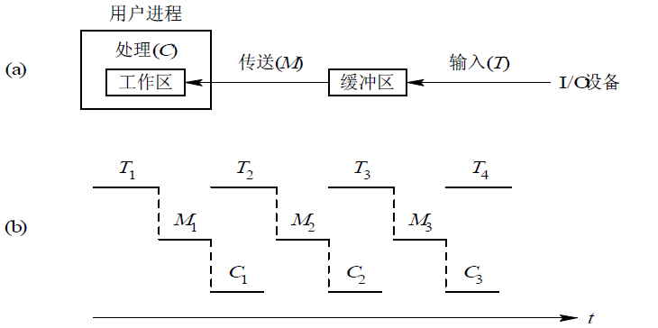

#### 设从磁盘将一块数据传送到缓冲区所用实际为80μs，将缓冲区中数据传送到用户区所用时间为40μs，CPU处理数据所用的时间为30μs。则处理该数据，采用单缓冲传送磁盘数据，系统所用总时间为（）。  
答案: 120μs
解析：磁盘到缓冲区所用时间T，缓冲区到用户区时间为M，CPU处理数据时间为C。  
系统对每一块数据的处理时间=max(T,C)+M。  
T与C是并行的，资源不冲突，同时进行。

