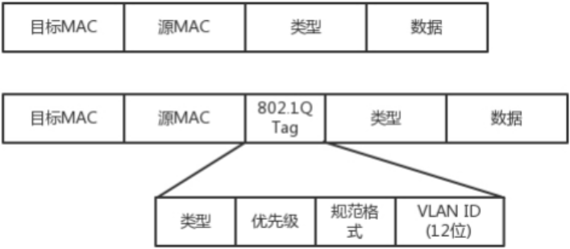
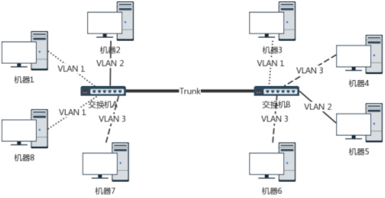

## 一. 从物理层到MAC层
### 第一层：物理层
利用网线进行电脑连电脑  
* 网线水晶头：第1、2和3、6脚，分别起收、发信号的作用。
* 1-3、2-6交叉接法  
* 网线交叉好后，还要配置两台电脑的IP地址、子网掩码、默认网关，三项配置成一个网络。  

**局域网(LAN)**  
**集线器(HUB)**：一层设备，完全工作在物理层，采取广播的模式，将自己收到的的每一个字节都复制到其他端口上去

### 第二层：数据链路层（MAC层）
>解决问题：  
1. 如果每台电脑都在发包，会不会产生混乱，有没有谁先发谁后发的规则？
>>MAC（Medium Access Control）：媒体访问控制。使用多路访问规则解决媒体接入控制（堵车）问题。  
解决多路访问的堵车问题的3种方式：信道划分、轮流协议、随机接入协议（以太网使用的协议）  
2. 包要发给谁？谁接收？  

有了目标MAC地址，数据包在链路上广播，MAC的网卡才能发现这个包是给他的。
3. 如果发送的时候出现了错误怎么办？
>>循环冗余检测（CRC）：通过XOR异或算法，检测包在发送的过程中是否出现错误
4. 如果源机器不知道目标机器的MAC地址，只知道IP地址要怎么办呢？一个广播的网络里接了N台机器，如何知道IP对应的机器的MAC地址呢？
>>ARP协议：已知IP地址，求MAC地址的协议。
在一个局域网里，知道了IP地址，但不知道MAC地址时，进行如下图所示的操作。

其中具体的ARP请求报文格式如下所示   

交换机(SWIITH)：二层设备，会进行学习，在一开始使用的时候也是像集线器一样工作，但是交换机会记住每个MAC对应的接口，即存储在转发表中，之后就直接查表发给目标机器，这样就能够连接更多机器进行通信而不用担心冲突问题了。  
>解决问题：如何知道目标MAC地址就是连接某个口的电脑的MAC地址呢？
>>使用一种设备，能把MAC头拿下来，检查一下目标MAC地址，然后根据策略进行转发。这种设备就是交换机。

## 二. MAC层：交换机与VLAN
>解决问题：如何解决多个交换机之间的环路问题？
### 1. STP协议（Spanning Tree Protocol）
#### 4个重要概念
**Root Bridge**：根交换机。相当于“掌门”，位于最小生成树的根部。  
**Designate Bridge**：指定交换机。相当于“小弟”，即树枝，但不是叶子，叶子往往是主机。“指定”的意思是，我拜A做了大哥，其他交换机通过我到达根交换机A，就相当于拜了我做大哥。  
**Bridge Protocol Data Units**：BPDU，网桥协议数据单元。相当于“相互比较实力”的协议，只有“掌门”才能发，隶属于某个“掌门”的“小弟”只能传达“掌门”的指示。  
**Priority Vector**：优先级向量。相当于“实力”（值越小越腻害）。这是一组ID，[Root Bridge ID, Root Path Cost, Bridge ID, Port ID]。当两台交换机相连时，先比较各自“掌门”的ID，如果“掌门”一样，就是“师兄弟”，然后再比较与“掌门”的关系，关系越好（路径耗费越少）的获胜，如果路径耗费相同，就比较自身。  
#### STP的工作过程

##### (1) 一开始所有交换机都认为自己是“掌门”，被分配了各自的网桥ID和优先级；   
##### (2) 大家都发送各自的BPDU，第一轮比拼后，优先级低的成为优先级高的小弟，无法再发送BPDU，只能转发掌门发送的BPDU。这时诞生了很多小门派（1-7、2-8、3-4、5-6），下面接着合并。  
##### (3) 合并的过程有四种情形：  
###### a. 掌门遇到掌门  
	5和1相遇，5的优先级低，于是率领自己的小弟归顺1的门下。     
###### b. 同门相遇  
&emsp;&emsp;i. 掌门与同门小弟相遇  
&emsp;&emsp;1与6相遇，1发现6本来就是自己门下的小弟了，只不过6的上司是5，5的上司是1。但是6到1的距离只有2，而先通过5再汇报给1的距离是1+4=5，所以让5和6都直接汇报给1。  
&emsp;&emsp;ii. 同门小弟相遇  
&emsp;&emsp;5和6相遇，大家都是小弟，先比掌门，发现掌门都一样，接着比和掌门的关系，6和掌门的关系更好（距离只有2），而且5直接汇报给1的距离是4，而如果5汇报给6再汇报给1，距离只有1+2=3，于是5干脆拜6为上司。  
###### c. 掌门与其他门派小弟相遇  
&emsp;&emsp;2与7相遇，7搬出自己的掌门1来和2比，发现1比2强，于是2不得不带着弟子8归顺到7下面。  
###### d. 不同门派小弟相遇  
&emsp;&emsp;5和4相遇，不同门派，直接比掌门，5的掌门是1，4的掌门是3，1比3强，于是4归顺到5下面。后来3和4相遇，3发现4已经叛变了，这时4说我现在的掌门是1，比你腻害，要不你也来吧，于是3也归顺到1门下。  
#### (4) 最后生成一棵树，但是天下统一久了，也会有相应的问题。  
>解决问题：如何解决广播问题与安全问题？  
>>(1) 物理隔离：每个部门单独一个子网，有单独的交换机。但是有的部门人多，有的人少，交换机的口有的不够用，有的又太浪费，再加上各个部门人员变动，效率不高。  
(2) 虚拟隔离，即虚拟局域网。  

### 2. 虚拟局域网VLAN
* 一个交换机上连接了不同局域网的机器，通过在二层的头上加个TAG，交换机根据VLAN ID来识别这个包属于哪个虚拟局域网的，然后发给所有对应的局域网的机器上，不是这个虚拟局域网的就不发送。VLAN ID有12位，所以一个虚拟局域网里最多可以有4096个用户。

* 每个VLAN所对应的的交换机的口是可以设置的，比如一个交换机的某个口原本是属于VLAN30的，后面可以改成VLAN10的。  
* 支持VLAN 的交换机之间通过Trunk口相连，这个口可以转发任何VLAN的包。  

### 3. 小结
&emsp;&emsp;当交换机互联时，会遭遇环路问题，让网络包迷路，此时需要STP协议，利用交换机预先设定的优先级和交换机之间的距离，根据某些规则，将所有交换机连成一棵最小生成树。但是当交换机数目逐渐上升时，会出现广播数目过多、耗时过长、隔离隐私问题，此时需要利用虚拟局域网（VLAN）将不同类型用户的交换机隔离开来，增强广播的针对性。

## 三. IP层：ICMP中的ping与Traceroute
### 1. ICMP的格式
&emsp;&emsp;ping是基于ICMP协议工作的.（Internet Control Message Protocol，互联网控制报文协议）   
&emsp;&emsp;ICMP封装在IP包里。

&emsp;&emsp;ICMP报文最常用的类型是主动请求、出错报文。
### 2. 查询报文类型
**ping**: 查询报文，一种主动请求，并且获得主动应答的ICMP协议。比原生的ICMP增加了两个字段：  
&emsp;&emsp;**标识符**：用于标识这个报文是进行哪方面的请求。  
&emsp;&emsp;**序号**：对派出去的侦查兵进行编号。  
同时在选项数据里会存放发送请求的时间值，用于计算往返时间，说明路程长短。  
ping 要用到 ICMP 的两种类型：  
**ICMP ECHO REQUEST**: ping的主动请求的网络抓包。  
**ICMP ECHO REPLY**: 主动请求的回复。  

### 3. 差错报文类型
#### 终点不可达
* 网络不可达
* 主机不可达
* 协议不可达
* 端口不可达   
* 需要进行分片但设置了不分片位

#### 源站抑制
&emsp;&emsp;让源站放慢发送速度。
#### 超时
&emsp;&emsp;超过网络包的生存时间（TTL）。
#### 路由重定向
&emsp;&emsp;换一个距离目的地更近的路由发送。

### 4. ping: 查询报文类型的使用
ping的发送和接收过程：

* 在终端输入ping 192.168.1.2，回车后将发生如下过程。
* ping进程将调用OS的API，生成ICMP报文，同时将目标IP地址参数传给OS的API，OS给ICMP报文加上IP头和MAC头，并向网卡写入。ICMP报文内容大致意思为“主动请求8，你还好吗？”。ICMP报文的重要字段有：  
&emsp;&emsp;(1) 类型字段：此处主动请求类型为8   
&emsp;&emsp;(2) 顺序号：为了区分连续ping时发出的多个数据包。   
&emsp;&emsp;(3) 数据：插入发送时间，为了计算往返时间RTT  
* 网卡将这个包发出去，目标机器的网卡收到后，会触发中断，CPU的中断处理函数对这个包进行处理，分别拆下MAC头和IP头，确认是发给自己的，在网络层解析IP包时发现这是一个ICMP报文，和一般的包不一样，没有端口号，所以交给某个内核线程去解析接收到的ICMP报文。
* 解析后发现这是一个ping查询报文，于是目标机器的OS生成相应的应答报文，经过类似的步骤封装上IP和MAC头，由网卡发送出去。
* 最终源机器收到应答报文，解析后生成相应的信息显示在终端上。

### 5. Traceroute差错报文类型的使用
>**Traceroute的两大作用**  
>>(1) 设置特殊的TTL，用来追踪去往目的地时沿途经过的路由器.  
(2) 故意设置不分片，从而确定路径的最小MTU.  

>**Traceroute的流程**  
&emsp;&emsp;Traceroute发送的IP数据包是无法交付的UDP用户数据报，最终由目的主机发送终点不可达差错报文。这里注意源主机发送的不是ICMP报文，目的主机返回才是ICMP报文。
*  源主机向目的主机发送一连串的IP数据报，第一个数据报P1的生存时间TTL只有1，当P1到达第一台路由器R1时，R1收下它并把TTL减一，此时TTL等于0，于是R1把这个数据报丢弃，并向源主机发送一个ICMP超时差错报告报文。
* 第二个数据报P2的TTL为2，到达R1时将TTL减一变为1，R1再将这个数据报转发给R2，R2收到这个数据报，把TTL减一，此时TTL为0，于是R2将这个数据报丢弃，同时向源主机发送一个超时差错报告报文。
* 不断进行上面的步骤，直到最后一个数据报刚刚到达目的主机DST，DST不转发数据报，也不将TTL减一。DST发现这是一个端口不可达的UDP用户数据报，于是丢弃这个包，并向源主机发送ICMP终点不可达差错报告报文。
* 最终源主机就获得了这条路径上所有路由器的IP和抵达每一个路由器的往返时间。

>**Tracert**：Windows下的路径跟踪命令
#### **Tracert** 与 **Traceroute** 的区别
* **Tracert** 发送的是icmp echo报文，**Traceroute** 发送的是不可交付的UDP数据报。
* **Tracert** 是Windows下的命令，**Traceroute** 是Linux下的命令

### 6. 小结
* ICMP相当于网络世界的侦察兵，有两种类型的ICMP报文。  
* ping：使用主动探查的查询报文  
* Traceroute：使用异常报告的差错报文  
* 区别：ping发送和接收的都是ICMP报文；Traceroute发送的是UDP用户数据报，接收的是ICMP报文。

## 四. 网关
&emsp;&emsp;网关一般是路由器的一个网口，路由器是一个三层转发的设备。路由器一般有5个网口或网卡，分别对应5个不同局域网的网关，当跨网段发送包时就需要经过路由器进行转发。  
&emsp;&emsp;跨网段转发包往往需要改变MAC头和IP头的一些内容。

&emsp;&emsp;问题：路由器取下包的MAC头和IP头后，要重新给这个数据包封装上新的IP头和MAC头，发给另一个网关，此时要选择发给哪个网关，IP和MAC头里要改变那些内容，这个由路由器中的规则决定，路由规则分为静态路由和动态路由。

### 路由表
&emsp;&emsp;一个转发信息库，用于存储从当前路由器发送到目标机器的最短路径中，下一站的IP地址。  
&emsp;&emsp;一个路由表中有多条路由规则。每条路由规则都至少包含以下3条内容：
* 目的网络：这个包要去的IP地址
* 出口设备：这个包应该从哪个网口发出去
* 下一跳网关：下一个路由器的网口IP

### 静态路由
&emsp;&emsp;静态路由就是路由器中一条一条预先设定好的规则。比如这个包要访问BBS站，那就应该发给2口，下一跳是IP2；如果要访问百度站，那就应该发给3口，下一跳是IP3，然后保存在路由里。
>下一跳：包从一个路由器A到另一个路由器B的过程，后接B的对应网口的IP

&emsp;&emsp;跨网段发送数据包的过程中要经过至少一个网关，在这个过程中，MAC头一定会改变。根据IP头是否改变，可将网关分为两类：
>**转发网关**：不改变IP，不同网段已经协商好，在本局域网内的主机不使用与另一局域网的主机相同的IP地址，此时可以不改变IP头，直接转发包。  
>**NAT网关**：改变IP。NAT，Network Address Translation，网络地址转换。两个网段没有协商，使用了冲突的IP地址，即在两个局域网内存在相同的IP地址，此时源主机发出来的包的IP头内的目标IP地址应该是目标机器的国际IP地址（类似于出国时用的护照），而不能是在他们局域网内的IP地址（类似于仅在国内通用的身份证，出国则不能使用身份证）。  
例如：经过第一个网关A（服务器A所在网段的网关）时，会将源IP地址改成对应的国际IP地址，然后发给网关B。网关B则将目标IP地址转换成自家的IP地址然后发给对应的服务器B。这里涉及2次IP地址转换。这里的网关A和网关B都是NAT网关。

&emsp;&emsp;静态路由可以配置策略路由，即使用控制转移策略，形成一个或多个路由表。
>* 根据目标IP地址来配置路由，此时仅有一个路由表，如：  
		ip route add 10.176.48.0/20 via 10.173.32.1 dev eth0  
就说明要去 10.176.48.0/20 这个目标网络，要从 eth0 端口出去，经过 10.173.32.1。
* 根据源IP地址、入口设备、TOS等选择路由表，此时有多个路由表，如：
		ip rule add from 192.168.1.0/24 table 10
		ip rule add from 192.168.2.0/24 table 20
表示来自192.168.1.0网段的包使用路由表10，来自192.168.2.0网段的包使用路由表20。
* 在一条路由规则中走多条路径，如：
		ip route add default scope global nexthop via 100.100.100.1 weight 1 nexthop via 200.200.200.1 weight 2
表示下一跳有2个地方可以去，100.100.100.1和200.200.200.1，权重分别是1和2.

### 动态路由
>为什么要有动态路由？
>>当网络规模十分庞大时，一旦某个部位出了问题，就需要人工手动去维修路由、配置路由，十分麻烦，此时，让路由器学会自动配置路由的算法应运而生，即动态路由算法。

&emsp;&emsp;使用动态路由路由器，可根据动态路由协议生成动态路由表，随网络运行状况的变化而变化。

#### 动态路由选择协议（应用层的进程）
&emsp;&emsp;互联网划分为许多较小的自治系统（AS，Autonomous System），一个AS是一组主机和使用相同路由选择协议的路由器集合，并由单一机构管理。比如电信和联通，就是2个不同的自治系统。  
* 内部网关协议 IGP（Internal Gateway Protocol）：单个AS内部的路由选择协议  
* 外部网关协议 EGP（Exterior Gateway Protocol）：不同AS之间的路由选择协议，为两个相邻的位于各自AS边界上的路由器提供交换信息的方法。

##### 内部网关协议 RIP（Routing Information Protocol，路由信息协议）
&emsp;&emsp;基于距离矢量路由算法（Ford算法）。按固定的时间间隔仅与相邻路由器交换路由表。经过若干次交换后，所有的路由器都将知道到达本AS中所有路由器的最短距离和下一跳路由器地址。
>缺点：只有到达其他路由器的下一跳的路由器地址，没有全网的拓扑结构图，当其中一个路由器故障时，无法将故障信息快速传递给其他所有路由器。更新过程收敛慢。

##### 内部网关协议 OSPF（Open Shortest Path First，开放式最短路径优先）
&emsp;&emsp;基于链路状态路由算法（Dijkstra算法）。所谓链路状态，就是与哪些路由器相连，以及链路的度量，度量用费用、距离、时延、带宽等来表示。
>特点：
>>(1)每个路由器都向AS中的所有路由器发送信息（洪泛法）   
(2)发送的信息是与相邻路由器的链路状态    
(3)只有当链路状态发生变化，路由器才会发送信息

>每个路由器都拥有全网的拓扑结构图，并且是一致的，更新过程收敛更快。

##### 外部网关协议 BGP（Border Gateway Protocol，边界路由协议）
&emsp;&emsp;基于无类型路径矢量路由算法。
>问题：为什么要有BGP？AS之间的路由选择为什么会很困难？
* 互联网规模很大
* 不同AS内部使用的路由选择协议不同，无法准确定义路径的度量
* 必须考虑有关的策略和AS自定义的规则，比如有的AS不让其他AS经过。

&emsp;&emsp;每个AS配置BGP发言人（eBGP），通过在两个相邻的eBGP间建立TCP连接来交换路由信息。

**Q：eBGP和iBGP中，eBGP是BGP发言人，用于连接相邻AS的BGP发言人。那iBGP是AS内部的BGP，相当于内部网关协议，和RIP同一个层面？？？**
