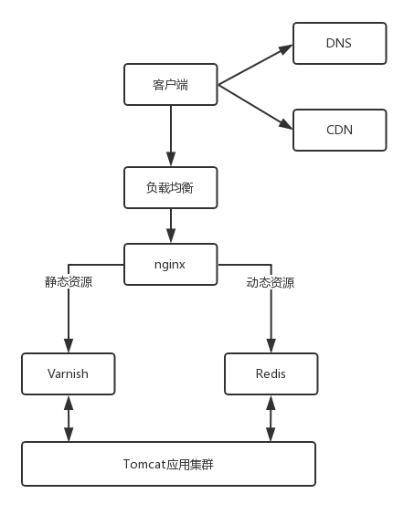

# 应用层

## HTTP协议
* 统一资源定位符：URL，域名。
----------------------------------
### HTTP请求报文
##### HTTP请求的准备
1. 浏览器中输入URL后，交给DNS(域名解析器)服务器，得到对应的IP地址
2. 建立TCP连接

##### HTTP请求的构建
###### HTTP请求格式

**1. 请求行**   
* 方法：
###### GET
获取资源。从服务器获取资源，比如一个页面，或者一个JSON字符串。   
###### HEAD
获取报文首部。与GET类似，但是不返回实体主体，主要用于检验URL的有效性。
###### POST
传输实体主体。向服务器发送一些信息，比如用户在表单中填写的信息，放在正文中，一般是JSON格式。  
>GET操作具有幂等性，POST不具有幂等性
###### PUT
上传文件。不带验证机制，任何人都可上传文件，因此一般不使用。
>PUT也是向服务器传送东西，但有所不同的是，POST是创建资源，PUT是修改资源，但是是通过完全替代原始资源的形式进行修改，无法修改局部。  
###### PATCH
对资源进行部分修改。与PUT功能类似，但是PATCH可修改文件中的一部分，而PUT不行。  
###### DELETE
删除文件。与PUT相反。  
###### OPTIONS
查询支持的方法。查询指定的URL能够支持的方法，返回的内容如下：  
Allow：GET, POST, HEAD, OPTIONS
###### Connect
要求与代理服务器通信时建立隧道。使用SSL（Secure Socket Layer安全套接层）和TLS（Transport Layer Security传输层安全）协议对通信内容加密后经网络隧道传输。
###### Trace
追踪路径。服务器会将通信路径返回给客户端。Max-Forword首部字段。
* URL：https://www.163.com/

* 版本：HTTP 1.1

**2. 首部**  
通过冒号分隔的key value。  
* Accept-Charset：客户端可接受的字符集。防止服务端发送客户端不支持的字符集导致出现乱码。  
* Content-Type：正文格式。例如JSON。

###### 缓存

对于静态资源有Vanish缓存层，当缓存过期时才访问Tomcat应用集群。
* Cache-control：控制缓存。max-age指令。
* If-Modified-Since：只有当服务端更新了资源，客户端才需要下载。如果没有更新，服务端会返回"304 Not Modified"的响应，客户端便不用下载，节省带宽。

**3. 实体**  
即正文内容。

##### HTTP请求的发送
应用层：HTTP协议基于TCP，使用面向连接的方式发送请求。通过stream二进制流的方式传送。  
传输层：到TCP层，TCP将二进制流包装成一个一个的报文段，加上序列号，然后将本机IP地址与目的IP地址加入IP头，把IP包交给IP层。
网络层：IP层根据目标IP地址判断是不是在本地局域网中，如果是，就发送ARP获取目标主机的MAC地址；如果不是，就发送ARP获取网关的MAC地址。然后连同本机MAC地址加入MAC头，交给MAC层。  
数据链路层：MAC层通过交换机根据目标MAC地址，将这个包发送出去。如果是本地主机，就直接发送给目标主机。如果是发送到网关，网关查看MAC地址发现的确是发给自己的，然后取下IP头查看目的IP地址，根据路由协议进行下一跳。经过若干个下一跳后到达最后一跳，这个路由器上的目标网关发现目标IP地址就是自己局域网下的一个IP地址，于是发送ARP获取目标MAC，连同自己的MAC地址加上MAC头后发送出去，最终到达目标主机。  
目标主机收到这个包后，取下MAC头，IP头，发现确实是发给自己的，然后又根据IP头中的协议项，知道上一层是TCP层，于是将这个包交给TCP层，TCP查看里面的序列号，发现的确是自己想要的，于是放入缓存中，同时返回一个ACK包。    
TCP层根据TCP头的目标端口号知道这是HTTP服务器这个进程监听的端口，于是将这个包交给HTTP层，HTTP层知道了这个请求是要访问一个网页，于是返回这个网页给客户端。  

----------------------------------
### HTTP响应报文
##### HTTP返回的构建

**1. 返回行**
* 版本：HTTP 1.1

* 状态码：表示HTTP请求的结果。200表示正常，404表示服务器无法响应这个请求。

* 短语：简单说明产生这个状态的原因。

**2. 首部**
* Retry-After：告诉客户端应该多久后再次尝试。
* Content-Type：HTML或JSON

**3. 实体**
如果请求的是一个页面，那么实体中就是一个HTML格式的正文。

##### HTTP返回的发送
将HTTP报文交给Socket去发送，然后发给TCP，TCP将这个HTML分成一个一个的报文段发送出去，也是同样的逻辑过程（物理过程不一定完全相同），最终到达目的主机。目的主机摘下MAC头、IP头，发现是发送给自己的，然后交给TCP层，发现端口号由浏览器这个进程监听，浏览器作为客户端也在监听某个端口，于是将这个HTML报文交给浏览器，浏览器拿到HTML报文后发现返回的是"200"，一切正常，于是从实体中取出HTML正文，展示出一个网页。
