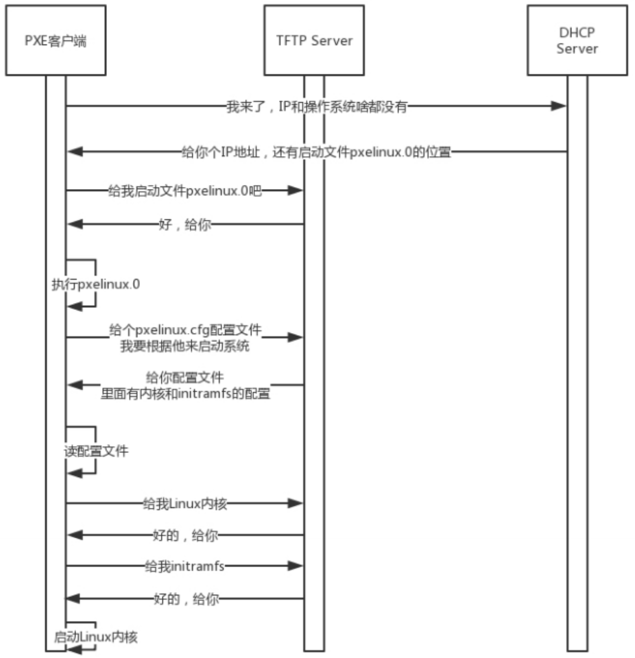

## 一. IP与MAC
**IP**：网络寻址（找到局域网的网关）  
**MAC**：局域网寻址（在局域网内找到目标机器）  
**最常用的私有IP地址**：192.168.0.3/24  
**CIDR**：无类型域间选路。一种地址表示形式，以/24为例，表示32位中前24位是网络号，后8位是主机号。另一种常见的 是/16。  
**广播地址**：192.168.0.255  
**子网掩码**：255.255.255.0  
**IP地址**：192.168.0.3  
**网络号**：192.168.0  
**私有网络的出口地址**：192.168.0.1  
**公有IP地址**：由组织统一分配，需要购买。  
**私有IP地址**：不同组织内的私有IP地址可重复。  

>MAC地址类似于身份证号，从硬件角度保证不同的网卡有不同的标识。
MAC地址的通信范围只有自己所在子网内，如果跨子网访问另一个IP地址，就不能只靠MAC地址访问了，而是要先通过IP地址找到另一个IP所在的子网，然后再通过MAC地址找到目标网卡。

#### 总结
>IP 是地址，用来定位；MAC是身份证，不能定位  
CIDR用来判断是不是本地人  
IP分公有IP和私有IP

## 二. DHCP与PXE
不同的系统的配置文件格式不同，但无非就是CIDR、子网掩码、广播地址、网关地址。
#### 1. 动态主机配置协议(DHCP)  
* DHCP Discover  
* DHCP Server  
* DHCP Offer  

#### 2. 预启动执行环境(PXE)

#### 3. 总结
* DHCP协议用来给客户租用IP地址，像房产中介，要商谈、签约、续租、广播还不能“抢单”。  
* DHCP协议能给客户推荐“装修队”PXE，能够安装操作系统.
