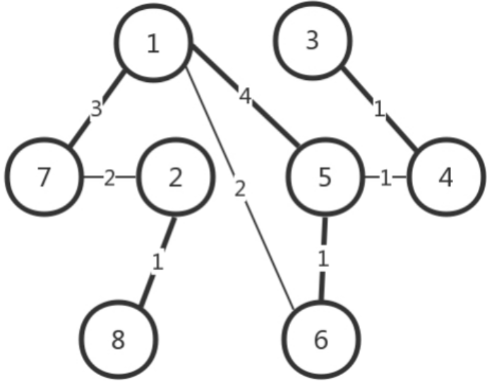

## 一. 从物理层到MAC层
### 第一层：物理层
利用网线进行电脑连电脑
	网线水晶头：第1、2和3、6脚，分别起收、发信号的作用。
				1-3、2-6交叉接法
	网线交叉好后，还要配置两台电脑的IP地址、子网掩码、默认网关，三项配置成一个网络。
局域网(LAN)
集线器(HUB)：一层设备，完全工作在物理层，采取广播的模式，将自己收到的的每一个字节都复制到其他端口上去

### 第二层：数据链路层（MAC层）
>解决问题：  
1. 如果每台电脑都在发包，会不会产生混乱，有没有谁先发谁后发的规则？
>>MAC（Medium Access Control）：媒体访问控制。使用多路访问规则解决媒体接入控制（堵车）问题。  
解决多路访问的堵车问题的3种方式：信道划分、轮流协议、随机接入协议（以太网使用的协议）  
2. 包要发给谁？谁接收？  

有了目标MAC地址，数据包在链路上广播，MAC的网卡才能发现这个包是给他的。
3. 如果发送的时候出现了错误怎么办？
>>循环冗余检测（CRC）：通过XOR异或算法，检测包在发送的过程中是否出现错误
4. 如果源机器不知道目标机器的MAC地址，只知道IP地址要怎么办呢？一个广播的网络里接了N台机器，如何知道IP对应的机器的MAC地址呢？
>>ARP协议：已知IP地址，求MAC地址的协议。
在一个局域网里，知道了IP地址，但不知道MAC地址时，进行如下图所示的操作。
   
其中具体的ARP请求报文格式如下所示   

交换机(SWIITH)：二层设备，会进行学习，在一开始使用的时候也是像集线器一样工作，但是交换机会记住每个MAC对应的接口，即存储在转发表中，之后就直接查表发给目标机器，这样就能够连接更多机器进行通信而不用担心冲突问题了。
解决问题：如何知道目标MAC地址就是连接某个口的电脑的MAC地址呢？
使用一种设备，能把MAC头拿下来，检查一下目标MAC地址，然后根据策略进行转发。这种设备就是交换机。

## 二. 交换机与VLAN
>解决问题：如何解决多个交换机之间的环路问题？
### 1. STP协议（Spanning Tree Protocol）
#### 4个重要概念
**Root Bridge**：根交换机。相当于“掌门”，位于最小生成树的根部。  
**Designate Bridge**：指定交换机。相当于“小弟”，即树枝，但不是叶子，叶子往往是主机。“指定”的意思是，我拜A做了大哥，其他交换机通过我到达根交换机A，就相当于拜了我做大哥。  
**Bridge Protocol Data Units**：BPDU，网桥协议数据单元。相当于“相互比较实力”的协议，只有“掌门”才能发，隶属于某个“掌门”的“小弟”只能传达“掌门”的指示。  
**Priority Vector**：优先级向量。相当于“实力”（值越小越腻害）。这是一组ID，[Root Bridge ID, Root Path Cost, Bridge ID, Port ID]。当两台交换机相连时，先比较各自“掌门”的ID，如果“掌门”一样，就是“师兄弟”，然后再比较与“掌门”的关系，关系越好（路径耗费越少）的获胜，如果路径耗费相同，就比较自身。  
#### STP的工作过程

(1) 一开始所有交换机都认为自己是“掌门”，被分配了各自的网桥ID和优先级；   
(2) 大家都发送各自的BPDU，第一轮比拼后，优先级低的成为优先级高的小弟，无法再
发送BPDU，只能转发掌门发送的BPDU。这时诞生了很多小门派（1-7、2-8、3-4、
5-6），下面接着合并。  
(3) 合并的过程有四种情形：  
	a. 掌门遇到掌门  
	5和1相遇，5的优先级低，于是率领自己的小弟归顺1的门下。     
	b. 同门相遇  
		i. 掌门与同门小弟相遇  
		1与6相遇，1发现6本来就是自己门下的小弟了，只不过6的上司是5，5的上司是1。但是6到1的距离只有2，而先通过5再汇报给1的距离是1+4=5，所以让5和6都直接汇报给1。  
		ii. 同门小弟相遇  
		5和6相遇，大家都是小弟，先比掌门，发现掌门都一样，接着比和掌门的关系，6和掌门的关系更好（距离只有2），而且5直接汇报给1的距离是4，而如果5汇报给6再汇报给1，距离只有1+2=3，于是5干脆拜6为上司。  
	c. 掌门与其他门派小弟相遇  
	2与7相遇，7搬出自己的掌门1来和2比，发现1比2强，于是2不得不带着弟子8归顺到7下面。  
	d. 不同门派小弟相遇  
	5和4相遇，不同门派，直接比掌门，5的掌门是1，4的掌门是3，1比3强，于是4归顺到5下面。后来3和4相遇，3发现4已经叛变了，这时4说我现在的掌门是1，比你腻害，要不你也来吧，于是3也归顺到1门下。  
(4) 最后生成一棵树，但是天下统一久了，也会有相应的问题。  
>解决问题：如何解决广播问题与安全问题？  
(1) 物理隔离：每个部门单独一个子网，有单独的交换机。但是有的部门人多，有的人少，交换机的口有的不够用，有的又太浪费，再加上各个部门人员变动，效率不高。  
(2) 虚拟隔离，即虚拟局域网。  

### 2. 虚拟局域网VLAN
* 一个交换机上连接了不同局域网的机器，通过在二层的头上加个TAG，交换机根据VLAN ID来识别这个包属于哪个虚拟局域网的，然后发给所有对应的局域网的机器上，不是这个虚拟局域网的就不发送。VLAN ID有12位，所以一个虚拟局域网里最多可以有4096个用户。

* 每个VLAN所对应的的交换机的口是可以设置的，比如一个交换机的某个口原本是属于VLAN30的，后面可以改成VLAN10的。  
* 支持VLAN 的交换机之间通过Trunk口相连，这个口可以转发任何VLAN的包。  

### 3. 小结
>当交换机互联时，会遭遇环路问题，让网络包迷路，此时需要STP协议，利用交换机预先设定的优先级和交换机之间的距离，根据某些规则，将所有交换机连成一棵最小生成树。但是当交换机数目逐渐上升时，会出现广播数目过多、耗时过长、隔离隐私问题，此时需要利用虚拟局域网（VLAN）将不同类型用户的交换机隔离开来，增强广播的针对性。

## 三. ICMP与ping
